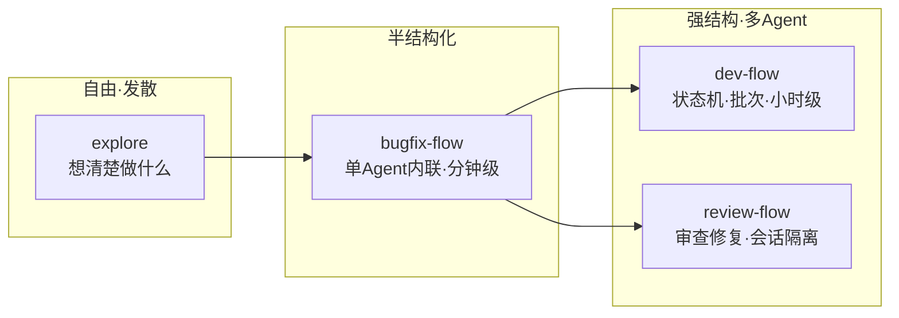
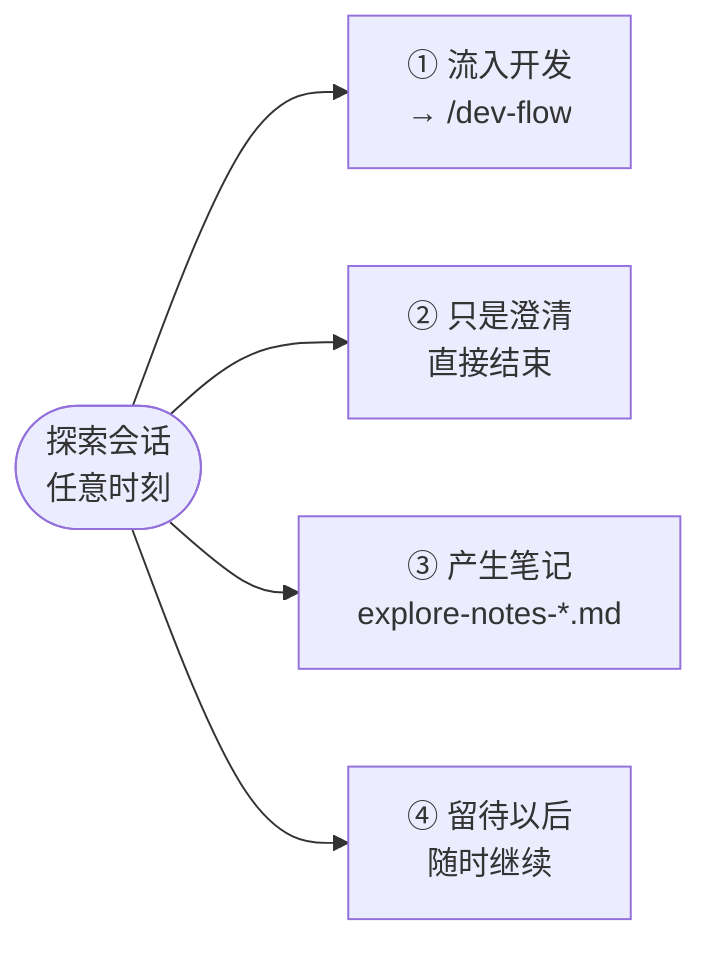
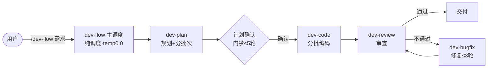
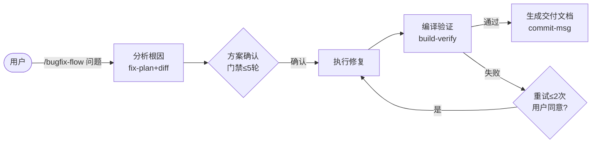
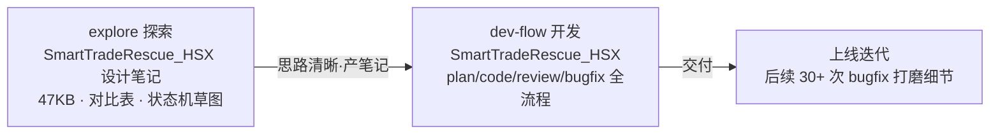

# AI工作流Workflow介绍与使用

## 目录
1. [workflow 前言](#workflow-前言)
2. [AI工作流四层落地架构](#AI工作流四层落地架构)
3. [我的工作流](#我的工作流)
4. [工作流实战](#工作流实战)

---

## workflow 前言

### 什么是AI工作流？

**一句话定义：**

AI工作流就是**给AI定好办事流程**，把复杂任务拆成「一步步固定步骤」，让AI按顺序、按规则自动干完。

**生活**：

单纯大模型 = 聪明但随性的新人，交代一句大任务容易漏步骤、瞎做、不稳定

AI工作流 = 标准化作业SOP（Standard Operating Procedure，标准作业程序），先做啥、后做啥、出错怎么办，全部规定好

---

### 为什么需要AI工作流

**没有工作流（纯对话Prompt）**

- 容易忘上下文、漏步骤

- 结果不稳定，每次回答不一样

- 复杂任务干不明白、容易瞎编

**有工作流（分步执行）**

- 步骤固定、结果稳定、可复盘

- 支持判断、分支、循环、重试

- 哪里出错改哪里，不用全盘重写

**核心价值：把AI“靠运气输出”变成“稳定工业化输出”**

---

##  AI工作流四层落地架构

从低门槛到高定制，逐层递进：

**1\. 无代码平台编排｜2\. 自定义Skill能力插件｜3\. 自定义Agent智能体｜4\. 自研AI底座**

层级关系：**自研底座 → 支撑Agent → 装配Skill → 画布编排落地**

---

### 第一层｜无代码平台编排（Dify/Coze/FastGPT）

**定位：快速落地的标准化流程工具**

**优点**

- 零/低代码，拖拉拽即可搭建流程

- 自带日志、接口、权限、发布能力

- 最快落地、最低成本、适合快速验证

**缺点**

- 受限于平台能力，天花板固定

- 复杂、个性化流程不够灵活

- 深度业务定制无法实现

**口诀：上手最快、够用就行，但不够自由**

---

### 第二层｜自定义Skill（能力插件）

**定位：可复用的AI原子能力**

**优点**

- 把单一功能封装成插件，一次开发、多处复用

- 可给工作流用，也可给Agent用

- 轻量化扩展，不依赖平台原生能力

**缺点**

- 只是“单一能力”，没有流程逻辑

- 单独无法完成完整复杂任务

- 需要依靠工作流/Agent调度才能生效

**口诀：能力可复用，只管干活，不管流程**

---

### 第三层｜自定义Agent（OpenCode/CodeBuddy）

**定位：自主思考、自主规划的智能执行者**

**优点**

- 不用固定死步骤，给目标就能自己拆解任务

- 能动态选工具、自适应突发情况、灵活度极高

- 适合复杂、多变、无固定流程的场景

**缺点**

- 自主性太强，容易跑偏、控制难度大

- 结果不稳定，调试难度大

- 开发和运维成本远高于固定工作流

**口诀：最聪明灵活，但管好它难度较大**

---


### 第四层｜自研AI底座

**定位：完全自主可控的底层架构**

**优点**

- 100%自主可控，无平台限制

- 适配高并发、强合规、深度定制业务

- 性能、安全、权限、日志全自定义

**缺点**

- 投入极大、周期长、需要专业团队

- 需要维护调度、状态、记忆、工具协议等底层

- 小场景极度浪费资源

**口诀：完全自由，但最贵、最重**

---

### 总结

|层级|核心优势|核心劣势|适用场景|
|---|---|---|---|
|平台编排|快、简单、零代码|能力受限、不灵活|快速验证、常规流程|
|自定义Skill|可复用、轻量扩展|无流程、不能独立跑|通用能力封装|
|自定义Agent|智能、灵活、自适应|不可控、难调试|复杂多变任务|
|自研底座|全可控、高安全、高性能|成本高、周期长|企业核心业务、强合规|

> 四层架构循序渐进，按需选型，避免过度开发

---

## 我的工作流

基于第三层「自定义 Agent」架构，我搭建了 **4 个工作流 + 1 个前置探索**（explore），覆盖从「想清楚」到「做出来」的完整链路。

### 4 个工作流总览

| 工作流 | 类型 | 一句话定位 | 架构模式 | 结构化程度 | 典型命令 | 设计文档 |
|--------|------|-----------|---------|-----------|---------|---------|
| **explore** | 前置伪工作流 | 帮你想清楚「做什么、为什么」的思考伙伴 | 单 Agent · 立场驱动 | 最弱（自由对话） | `/explore 技术选型` | [explore-DESIGN.md](explore-DESIGN.md) |
| **dev-flow** | 开发流程 | 从需求到交付的全流程开发 | 多 Agent 编排（1主+4子） | 强 | `/dev-flow 实现用户登录` | [dev-flow-DESIGN.md](dev-flow-DESIGN.md) |
| **bugfix-flow** | 修复流程 | 单个 Bug 的快速修复 | 单 Agent 内联 | 中 | `/bugfix-flow 登录报500` | [bugfix-flow-DESIGN.md](bugfix-flow-DESIGN.md) |
| **review-flow** | 审查流程 | 存量代码审查 + 定向修复 | 多 Agent 编排（1主+2子） | 强 | `/review-flow src/` | [review-flow-DESIGN.md](review-flow-DESIGN.md) |

> 以上文档链接为 docs 目录下的设计文档。

### 结构化程度光谱

四个 flow 按「结构化程度」排成一条光谱——越靠左越自由发散，越靠右越强控流程：



**一句话分工**：explore 负责把问题**想清楚**，其余三个 flow 负责把事情**做完**。

---

### explore｜前置探索（想清楚）

**一句话定位**：自由探索模式，是「思考伙伴」，不是实现工具——永不写业务代码，只负责把问题、选型、风险想明白。

**用法示例**：

```bash
/explore                                    # 空：自行感知项目后主动开题
/explore postgres vs sqlite 选哪个           # 技术选型对比
/explore 认证系统越来越难维护了               # 具体问题分析
```

**核心设计**：它是「立场（stance）」而非「工作流」——无固定步骤、无门禁、无必产物，靠**宽读取、窄写入**的漏斗形权限收敛安全性：

```text
读取面（宽，免确认）                写入面（窄，双保险）
read / bash* / webfetch* / task      源代码零写入
         │                           仅经用户同意写
         └──── 全库可见 ────▶  dev-flow/explore/ 探索笔记
```

**四种出口**（没有终点，随时可走可留）：



**关键要点**：

- **温度 0.8**（四个 flow 中最高）——发散思维、头脑风暴
- **接地探索**——读真实代码、git 历史，画 ASCII 架构图，不只纸上谈兵
- **明确跃迁边界**——即使说「就按这个做」，也必须确认退出探索模式才进开发流程
- 位于所有执行流程**上游**，把接力棒交给 dev-flow / bugfix-flow

---

### dev-flow｜全流程开发（做出来）

**一句话定位**：多 Agent 编排式开发管线，一条命令跑完「规划→编码→审查→修复→交付」全流程。

**用法示例**：

```bash
/dev-flow 实现用户登录功能          # 直接给需求描述
/dev-flow dev-flow/20260824/用户登录/brainstorm.md   # 或给需求文档路径
```

**总体流程**：



**架构分工**（1 主 + 4 子，主 Agent 是纯调度器，不懂代码）：

| Agent | 一句话职责 | 温度 |
|-------|-----------|------|
| dev-flow | 调度、状态机流转、机械核验、汇总 | 0.0（完全确定） |
| dev-plan | 现状分析、架构设计、任务拆分、**计算批次** | 0.2 |
| dev-code | 按批编码、语法自检、勾选任务 | 0.3 |
| dev-review | 多维审查、分级问题清单、构建验证 | 0.4（最大发散） |
| dev-bugfix | 根因定位、最小化修复、回归验证 | 0.3 |

**关键机制**：

- **文件即契约**：子 Agent 不直接对话，靠 `plan.md`（唯一真理来源 SSOT）等报告文件接力
- **批次预计算 + 机械核验**：规划阶段就分好批次，编码后用 grep 勾选框判定完成度
- **双计数器防死循环**：修复迭代 ≤3 轮、同批重试 ≤2 次、计划确认 ≤5 轮

---

### bugfix-flow｜单 Bug 修复（做出来）

**一句话定位**：单 Agent 内联式修复流程，粒度小、链路短，一条命令修完一个 Bug。

**用法示例**：

```bash
/bugfix-flow 登录按钮点击后报 500 错误
```

**总体流程**：



**关键机制**：

- **单 Agent 内联**：分析—修复—验证共享同一上下文，路径最短、效率最高
- **状态持久化**：支持断点续作（中断后可从 `.flow-state.json` 恢复）
- **产物版本化**：`-v{attempt}` 保留每轮方案，便于回溯
- **3 类门禁**：方案确认 ≤5 轮、编译重试 ≤2 次、交付确认（可 reopened 继续修，≤3 次全局修复）

> **review-flow** 简述：多 Agent 编排式存量代码审查 + 定向修复，支持问题分级自选修复、仅报告模式，主 Agent 有五条红线禁止读源码，技术判断全部下放给子代理。详见 [review-flow-DESIGN.md](review-flow-DESIGN.md)。

---

## 工作流实战

工作流已在 **6 个真实项目**中投入使用，累计跑完 **百余次** explore / dev-flow / bugfix-flow / review-flow，覆盖需求分析、功能开发与 BUG 修复三大场景。

### 实战总览矩阵

行 = 项目，列 = 工作流，单元格数字 = 实际使用次数（来自各项目运行产物统计）：

| 项目 | 技术栈 | explore | dev-flow | bugfix-flow | review-flow |
|------|--------|:---:|:---:|:---:|:---:|
| **SmartEazy**（策略易） | C++ / Qt | 10+ | 4 | 67 | - |
| **EasyStrategyGo**（Go 服务） | Go | - | - | 6 | - |
| **TradeServer**（交易后台） | C++ / Go | - | - | 2 | - |
| **PC-Client-Qt**（智能客户端） | C++ / Qt | 1 | 1 | 12 | - |
| **ClientSession-Qt**（通信库） | C++ / Qt | - | - | 2 | - |
| **XtgSafeAssistant_Qt**（反外挂客户端） | C++ / Qt | - | 5 | 15 | 1 |

> `-` 表示暂无记录，数据基于各项目 `dev-flow/`、`bugfix-flow/`、`review-flow/` 目录下的 `.flow-state.json` 与 explore 笔记统计。

### 使用频率对比

```text
项目                 explore   dev-flow   bugfix-flow   review-flow
SmartEazy              ████        ██          ████████████
EasyStrategyGo                            ██
TradeServer                               █
PC-Client-Qt            █           █         ██████
ClientSession-Qt                                    █
XtgSafeAssistant_Qt                     █████        ███      █
```
（每个 `█` ≈ 1 次，仅示意相对规模）

**规律小结**：
- **bugfix-flow 使用最频繁**——日常存量代码的小修小补，轻量内联流程效率最高
- **explore 集中在核心业务项目**——SmartEazy 的 HSX 应急流程、PC-Client 的反外挂迁移，都在动手前先「想清楚」
- **dev-flow 用于大功能重构**——SmartEazy 应急流程、XtgSafeAssistant 虚拟机检测重构等

---

### 典型案例亮点

#### 亮点一：explore → dev-flow 衔接链（SmartEazy · HSX 应急流程）

`SmartEazy`（策略易）在**沪深新股申购应急（HSX Rescue）**改造上，走通了「先 explore 想清楚 → 再 dev-flow 做出来」的完整链路：



- **explore 阶段**产出多份设计笔记（如 `explore-notes-2026-07-08-HSX-design.md` 47KB、`BX-rescue-apply-detailed-design.md` 63KB），把应急流程的存储过程、状态流转画成架构草图
- **dev-flow 阶段**落地 `SmartTradeRescue_HSX` 功能，产出完整 `plan/code/review/bugfix` 报告
- **后续迭代**又通过 30+ 次 bugfix-flow 持续打磨（如 `bugfix-hsx-rescue-applycode`、`bugfix-hsx-rescue-usercancel`）

> 这个案例说明：复杂功能先用 explore **控风险、定方案**，再用 dev-flow **工业化落地**，最后 bugfix-flow **敏捷迭代**——三个工作流各司其职。

#### 亮点二：explore → dev-flow（PC-Client-Qt · 反外挂模块迁移）

`PC-Client-Qt` 在**反外挂辅助模块迁移**上使用 explore 先行分析：

- **explore**：产出 `explore-notes-2026-06-25-anti-cheat-migration.md`，梳理迁移影响面
- **dev-flow**：`anti-cheat-assistant-migration` 落地迁移，产物含完整计划与审查
- 体现了 explore 笔记可作为 dev-flow 需求文档输入的「显式交接」用法

#### 亮点三：dev-flow + bugfix-flow 持续迭代（XtgSafeAssistant · 虚拟机检测）

`XtgSafeAssistant`（反外挂客户端）围绕**虚拟机/多开检测**做了多轮大功能开发与大量修复：

- **dev-flow 重构 5 次**：`vm-detection-reliability`、`vm-detection-optimize-false-positive`、`vm-detection-rearchitecture`、`asyncCheck-optimization-plan`、`SubProcessManager`——不断优化检测可靠性与误报率
- **bugfix-flow 修复 15 次**：`bugfix-vm-threshold-and-qemu`、`bugfix-detection-timeout-block-eventloop`、`bugfix-checkVEMissingLog` 等，覆盖检测逻辑、事件循环、日志、编码（GB2312 乱码）等细节
- 体现了 dev-flow 负责**大版本重构**、bugfix-flow 负责**小问题快速修**的分工协同

---

### 分项目案例精选

#### SmartEazy（策略易）——使用最深入

| 时间 | 工作流 | 案例主题 | 说明 |
|------|--------|---------|------|
| 06-17 | dev-flow | BX 新股申购时间提前 | 全流程开发 |
| 07-06~08 | explore | SmartTradeRescue HSX 设计 | 47KB 设计笔记 |
| 07-09 | dev-flow | SmartTradeRescue_HSX | 应急流程落地 |
| 07-15 | dev-flow | SellTask_HSX_DoTask 重构 | 分批重构 |
| 06-17~08-18 | bugfix-flow | HSX 应急 / 申购 / 债券等 67 个 | 密集迭代修复 |
| 07-21 | explore | BX-rescue-apply 详细设计 | 63KB 设计笔记 |

#### EasyStrategyGo（Go 服务）

| 时间 | 工作流 | 案例主题 | 说明 |
|------|--------|---------|------|
| 06-15~16 | bugfix-flow | 日志同步 / 短信重试日志 | 6 次修复 |
| 08-03 | bugfix-flow | 用户同步告警 | 服务端修复 |
| 08-14 | bugfix-flow | B2B 同步丢错误信息 / 请求超时 | 联调问题 |

#### TradeServer（交易后台）

| 时间 | 工作流 | 案例主题 | 说明 |
|------|--------|---------|------|
| 08-13 | bugfix-flow | 多模块调用栈 | 栈信息修复 |
| 08-20 | bugfix-flow | 申购包 HTTP 超时 | 超时问题 |

#### PC-Client-Qt（智能客户端）

| 时间 | 工作流 | 案例主题 | 说明 |
|------|--------|---------|------|
| 06-25 | explore→dev-flow | 反外挂模块迁移 | explore 笔记 + 迁移开发 |
| 06-22~08-17 | bugfix-flow | 算法交易弹窗 / 委托确认 / 崩溃等 12 个 | 12 次修复 |

#### ClientSession-Qt（通信库）

| 时间 | 工作流 | 案例主题 | 说明 |
|------|--------|---------|------|
| 06-24 | bugfix-flow | 粘包处理 | onReceive 粘包 |
| 08-18 | bugfix-flow | Win7 栈限制 | 兼容性修复 |

#### XtgSafeAssistant_Qt（反外挂客户端）

| 时间 | 工作流 | 案例主题 | 说明 |
|------|--------|---------|------|
| 06-30~07-06 | dev-flow | 虚拟机检测可靠性 / 优化误报 / 重构 | 5 次大功能开发 |
| 06-15~07-29 | bugfix-flow | 检测 / 事件循环 / 编码等 15 个 | 15 次修复 |
| 06-18 | review-flow | 代码审查 | 1 次审查会话 |

---

### 实战收益

| 场景 | 解决的问题 | 工作流收益 |
|------|-----------|-----------|
| 需求分析 | 方案未想清就动手，返工多 | explore 先控风险、定方向 |
| 功能开发 | 大功能落地不可控 | dev-flow 批次化、门禁化交付 |
| BUG 修复 | 修完不知道有没有破坏别的 | bugfix-flow 强制编译验证 + 提交信息 |
| 代码质量 | 存量代码藏雷 | review-flow 审查 + 定向修复 |

**核心结论**：三个工作流形成「探索 → 开发 → 修复」的闭环，把 AI 从「靠运气输出」变成「稳定工业化输出」，已在真实业务项目中验证可行、可复用、可推广。

---
