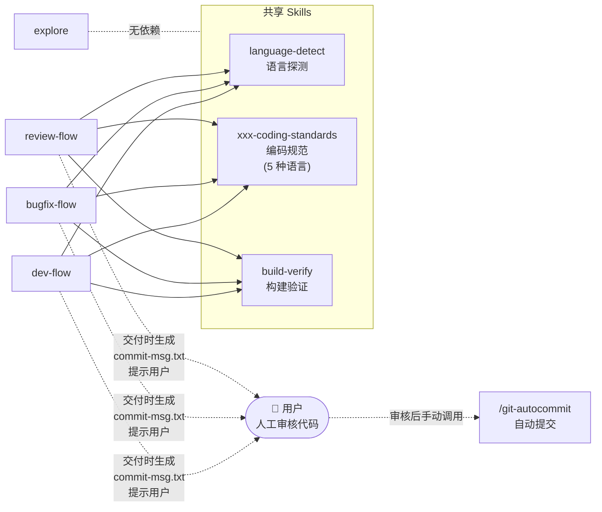
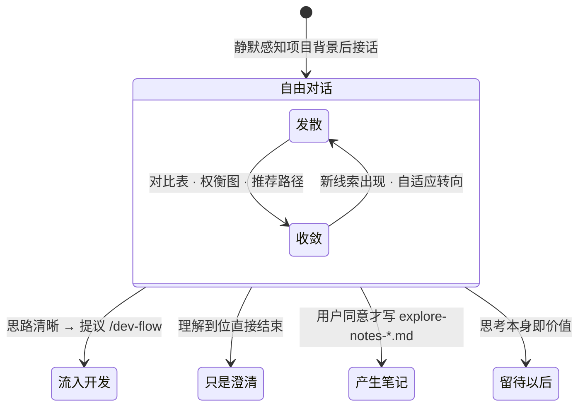
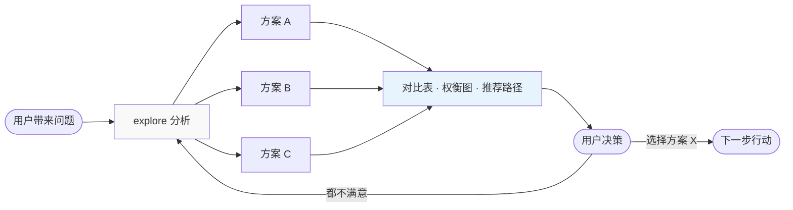
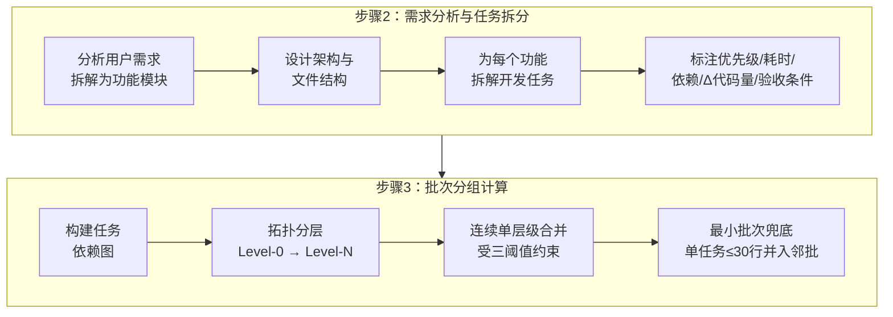
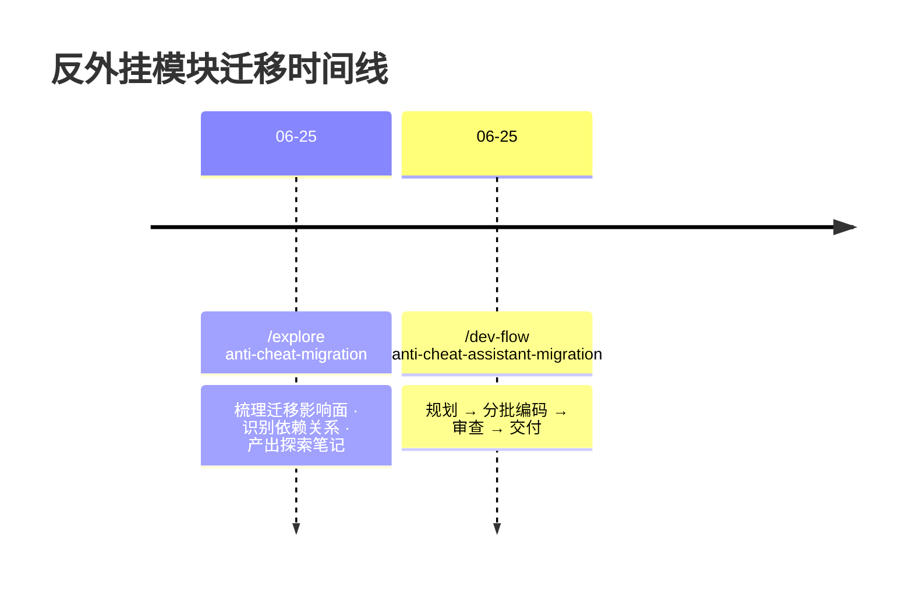

# AI工作流Workflow介绍与使用

## 目录
1. [前言](#前言)
2. [AI工作流四层落地架构](#AI工作流四层落地架构)
3. [我的工作流](#我的工作流)
4. [工作流实战案例](#工作流实战案例)

---

## 前言

### 什么是AI工作流？

**一句话定义：**

AI工作流就是**给AI定好办事流程**，把复杂任务拆成「一步步固定步骤」，让AI按顺序、按规则自动干完。

**比喻**：

单纯大模型 = 聪明但随性的新人，交代一句大任务容易漏步骤、瞎做、不稳定

AI工作流 = 标准化作业SOP（Standard Operating Procedure，标准作业程序），先做啥、后做啥、出错怎么办，全部规定好

---

### 为什么需要AI工作流

**没有工作流（纯对话Prompt）**

- 容易忘上下文、漏步骤

- 结果不稳定，每次回答不一样

- 复杂任务干不明白、容易瞎编

**有工作流（分步执行）**

- 步骤固定、结果稳定、可复盘

- 支持判断、分支、循环、重试

- 哪里出错改哪里，不用全盘重写

**核心价值：把AI"靠运气输出"变成"稳定工业化输出"**

落地方式从低门槛到高定制，可分为四个层级，按需选型：

---

## AI工作流四层落地架构

从低门槛到高定制，逐层递进：

**1. 无代码平台编排（快速落地）｜2. 自定义Skill/Command（可复用原子能力）｜3. 自定义Agent（SOP固化）｜4. 自研AI工具底座（完全自主可控）**

层级关系：**自研底座 → 支撑Agent → 装配Skill → 编排落地**

---

### 第一层｜无代码平台编排（快速落地的标准化流程工具）

**定位：快速落地的标准化流程工具**

**做法**：在 Dify/Coze/FastGPT 等平台上拖拉拽搭建流程节点，配置触发条件、输入输出与分支逻辑。

[]

**优点**

- 零/低代码，拖拉拽即可搭建流程

- 自带日志、接口、权限、发布能力

- 最快落地、最低成本、适合快速验证

**缺点**

- 受限于平台能力，天花板固定

- 复杂、个性化流程不够灵活

- 深度业务定制无法实现

**口诀：上手最快、够用就行，但不够自由**

---

### 第二层｜自定义Skill/Command（可复用的AI原子能力）

**定位：可复用的AI原子能力**

**做法**：把单一功能封装为独立的 Skill/Command 文件（如代码审查、构建验证），供 Agent 按需加载；也可借助 OpenSpec/SpecKit 等工具将多个能力组织成结构化开发流程。

**优点**

- 把单一功能封装成插件，一次开发、多处复用

- 可给工作流用，也可给Agent用

- Skill/Command 是通用协议，各个工具/平台都能适配

**缺点**

- 只是"单一能力"，没有流程逻辑

- 单独无法完成完整复杂任务，需要多个技能组合

- 需要依靠工作流/Agent调度才能生效

**口诀：能力可复用，只管干活，复杂流程干不了**

---

### 第三层｜自定义Agent（OpenCode/CodeBuddy等主流AI工具都支持）

**定位：用提示词把 SOP 固化成智能体**

**做法**：把「步骤顺序 + 约束 + 产物约定」写进 Agent 定义文件，AI 按流程办事；专项能力再委托给 Skill 复用。

**优点**

- Agent即角色，配置多个Agent角色，分工明确，协同完成工作任务

- 权限控制方便：读写、bash、git等权限灵活配置，防止大模型越权

- 流程约束 + 门禁后，兼得灵活性与稳定可复盘

- 天然支持人机协作：关键节点停下来等人拍板

**缺点**

- 寄生于宿主工具（OpenCode/CodeBuddy），受其能力边界限制，强依赖宿主工具

- 流程逻辑写在自然语言里，改流程 = 改提示词且需回归验证

- 长流程受上下文窗口限制，须靠文件落盘传递上下文、多Agent串联

- 执行质量仍取决于底层模型，不确定性需门禁与重试上限兜底

**口诀：SOP 写进提示词，门禁把关才靠谱**

---


### 第四层｜自研AI工具底座（完全自主可控的底层架构）

**定位：完全自主可控的底层架构**

**做法**：以 OpenCode 等开源 AI 工具为底座做二次开发，或基于 LangChain/LlamaIndex 等框架从零自研调度、状态、记忆与工具协议。

**优点**

- 100%自主可控，无平台限制

- 适配高并发、强合规、深度定制业务

- 性能、安全、权限、日志全自定义

**缺点**

- 投入极大、周期长、需要专业团队

- 需要维护调度、状态、记忆、工具协议等底层

- 小场景极度浪费资源

**口诀：完全自由，但最贵、最重**

---

### 总结

| 层级 | 做法 | 核心优势 | 核心劣势 | 适用场景 |
|------|------|---------|---------|---------|
| 平台编排 | 拖拉拽搭建流程节点 | 快、简单、零代码 | 能力受限、不灵活 | 快速验证、常规流程 |
| 自定义Skill | 封装独立 Skill/Command 文件 | 可复用、轻量扩展 | 无流程、不能独立跑 | 通用能力封装 |
| 自定义Agent | 写 Agent 定义文件 + Skill 委托 | SOP固化、角色分工明确 | 依赖宿主工具、提示词工程有门槛 | 通用工作流 |
| 自研底座 | 开源工具二次开发 / 框架自研 | 全可控、高安全、高性能 | 成本高、周期长 | 企业核心业务、强合规 |

> 四层架构循序渐进，按需选型，避免过度开发

---

## 我的工作流

基于第三层「自定义Agent」（OpenCode/CodeBuddy），我在日常开发中落地了一套 **4 个工作流的组合拳**：

- 1 个前置伪工作流：**explore**（探索思考）
- 3 个执行型工作流：**dev-flow**（中大型需求开发）/ **bugfix-flow**（小需求开发/Bug修复）/ **review-flow**（代码审查）

---

### 全景：一套组合拳

一句话分工：**explore 负责把问题想清楚，三个 flow 负责把事情做完。**


按「结构化程度」排成一条光谱：

| 维度 | explore | bugfix-flow | dev-flow / review-flow |
|------|---------|-------------|------------------------|
| 形态 | 立场驱动 | 单 Agent 内联 | 多 Agent 编排 |
| 步骤 / 门禁 | 零步骤 · 零门禁 | 4 步骤 · 3 类门禁 | 状态机 · 批次 · 人工门禁 |
| 耗时 | 无固定 | 分钟级 | 小时级 |
| 温度 | 0.8 发散思考 | 0.2~0.3 收敛执行 | 主控 0.0 机械调度 |

> 越往右越结构化：左边管「做什么、为什么」，右边管「怎么做、做出来」

**运行产物**：三个 flow 的报告与代码严格分离，产物写入指定目录：

| 工作流 | 产物目录 | 核心产物 |
|--------|---------|---------|
| dev-flow | `dev-flow/{日期}/{功能名}/` | `.flow-state.json` · `plan.md`（SSOT）· `code.md` · `review.md` · `bugfix.md` · `commit-msg.txt` |
| bugfix-flow | `bugfix-flow/{日期}/bugfix-{ID}/` | `.flow-state.json` · `fix-plan-v{N}.md` · `fix-result-v{N}.md` · `commit-msg.txt` |
| review-flow | `review-flow/{日期}/{审查目标}/` | `.flow-state.json` · `review.md` · `bugfix.md` · `commit-msg.txt` |
| explore | `dev-flow/explore/` | `explore-notes-{日期}-{主题}.md`（可选，用户同意才写入） |

> 产物不入 git，源码目录永远干净。`commit-msg.txt` 由报告文件机械提取生成，用户审核代码后手动调用 `/git-autocommit` 提交。

dev-flow 一次运行的完整产物示例：

```text
dev-flow/20260709/SmartTradeRescue_HSX/
├── .flow-state.json     # 流程状态，断点恢复依据
├── plan.md              # 开发计划 = 唯一真理来源（含批次锚点）
├── code.md              # 编码成果报告
├── review.md            # 审查报告（分级问题清单）
├── bugfix.md            # 修复记录
├── modified_files.txt   # 改动文件全集
└── commit-msg.txt       # 四段式提交信息
```

bugfix-flow 单次修复的标准产物：

```text
bugfix-flow/20260728/bugfix-apply-price-precision/
├── .flow-state.json    # 流程状态，断点恢复依据
├── fix-plan-v1.md      # 修复方案（含 diff）
├── errors.log          # 编译错误留痕（失败时追加）
├── commit-msg.txt      # 四段式提交信息
└── fix-result-v1.md    # 修复结果 + 审查报告
```

**依赖的 Skills 与 Commands**：三个 flow 共享 3 类可复用 Skill（内部调用），另有 1 个交付命令供用户审核后手动调用。explore 不依赖任何 skill：



| 类型 | 名称 | 一句话定位 | 被谁调用 |
|------|------|-----------|---------|
| Skill | `language-detect` | 扫描项目文件自动识别语言，实现`按需动态`加载对应编码规范`xxx-coding-standards` | dev-plan / bugfix-flow / review-flow-review |
| Skill | `xxx-coding-standards` | 5 种语言的编码规范（C++/Go/JS/Python/SQL）, 可以被`language-detect`主动加载，也可以被`Agent`按Skill规则加载 | dev-code / dev-review / dev-bugfix / bugfix-flow / review-flow-fix |
| Skill | `build-verify` | 小型工作流：静态检查（如：C/C++的cppcheck/clang-tidy） → 编译验证（最低保障能编译通过） → 结构化报告 | dev-review / dev-bugfix / bugfix-flow / review-flow |
| Command | `/git-autocommit` | 小型工作流：分析变更 -> 生成四段式提交信息 -> 自动Commit -> 用户确认是否push | **用户手动调用**（flow 交付后提示，人工审核代码后再提交） |

---

### 四个工作流总览

| 工作流 | 一句话定位 | 架构模式 | 适用场景 | 设计文档 |
|--------|-----------|---------|---------|----------|
| explore | 思考伙伴：动手前先把问题想清楚 | 立场驱动 · 零流程 | 需求分析、技术选型、方案对比、代码疑问 | [explore-DESIGN.md](./explore-DESIGN.md) |
| bugfix-flow | 小需求/Bug修复快车道：分钟级闭环 | 单 Agent 内联（4 步骤） | 小型需求、Bug 的快速修复与验证 | [bugfix-flow-DESIGN.md](./bugfix-flow-DESIGN.md) |
| dev-flow | 全流程开发流水线：一条命令从需求到交付 | 多 Agent 编排（1 主 + 4 子） | 从零开发完整功能、大型需求，小时级多批次 | [dev-flow-DESIGN.md](./dev-flow-DESIGN.md) |
| review-flow | 存量代码体检：先审查再自选范围修复 | 多 Agent 编排（1 主 + 2 子） | 老代码质量治理、模块级代码审查 | [review-flow-DESIGN.md](./review-flow-DESIGN.md) |

下面重点介绍使用频率最高、最能体现设计思想的三个：**explore → dev-flow → bugfix-flow**。

---

### explore：动手前，先把问题想清楚

#### 它最特殊——是一种立场，不是工作流

没有固定步骤、没有状态机、没有必须产物，就是一场与 AI 的深度对话：

| 维度 | 三个执行 flow | explore |
|------|--------------|---------|
| 流程形态 | 固定步骤序列 | 自由对话，跟随话题漂移 |
| 状态机 / 断点续作 | 有（.flow-state.json） | 无，会话即状态 |
| 必须产物 | plan.md 等 | 无必须产出，笔记可选 |
| 结束条件 | 交付等明确终点 | 没有终点，随时可走可留 |

#### 关键设计【部分参考openspec的explore设计】

**① 宽读窄写的漏斗权限** —— 读得宽（全库+外网免确认），写得窄（源代码零写入）：

```text
读取面（宽，免确认）                写入面（窄，双保险）
┌──────────────────────┐          ┌───────────────────────────┐
│ read / bash / webfetch│  ──────▶ │ 提议 → 用户同意后才写入     │
│ 全库可见 + 外部调研      │          │ 仅允许 dev-flow/explore/*  │
└──────────────────────┘          └───────────────────────────┘
```

**② 发散 ⇄ 收敛的对话循环，四种出口** —— 永不自动开工，跃迁必须用户确认：



**③ 只给方案，不拍板** —— 发散探索、列出多种方案并做对比，最终选择权留给用户：



**④ 模型温度 0.8 全场最高** —— 温度越高输出越多样，探索阶段需要的是「想到尽可能多的可能性」而非精准执行，0.8 发散度天然匹配头脑风暴与多向联想：

| 对比 | explore | dev-flow 主控 | dev-code | dev-review | bugfix-flow |
|------|---------|-------------|----------|------------|-------------|
| 温度 | **0.8** | 0.0 | 0.3 | 0.4 | 0.3 |
| 定位 | 最大发散 | 完全确定 | 适度灵活 | 审查发散 | 适度灵活 |

#### 与下游的接力（松耦合）

探索笔记可直接作为需求文档输入，也可以口头交接结论：

```bash
# 显式交接：探索笔记 = 需求文档
/dev-flow dev-flow/explore/explore-notes-2026-07-08-SmartTradeRescue_HSX-design.md

# 口头交接：把探索中达成的结论复述为需求
/dev-flow 参考BX版实现HSX应急下单工具
```

> 下游 flow 并不依赖探索笔记存在——没探索过也能直接跑，笔记只是提升输入质量的可选加速器。

---

### dev-flow：中大型需求开发流水线

一条命令启动完整生命周期：

```bash
/dev-flow 实现用户登录功能            # 直接给需求描述
/dev-flow xxx/explore-notes-2026-07-08-SmartTradeRescue_HSX-design.md         # 或给需求文档路径（含探索笔记）
```

```text
需求规划 → 计划确认 → 分批编码 → 审查 → BUG修复(≤3轮) → 生成Git提交信息 → 交付
```

#### 架构：一个「不懂代码的主管」带 4 个专家

主 Agent 是**纯调度器**——只做传参、决策、汇总，禁止读源码、评方案；所有技术活下放给 4 个SubAgent，彼此不共享上下文，靠文件接力（文件即契约）：


#### 关键设计

| # | 机制 | 解决什么问题 |
|---|------|------------|
| 1 | 文件即契约 | SubAgent间靠 plan/code/review 报告接力，增减字段只改对应SubAgent定义，主流程零改动，不通过主Agent通信，减少Token消耗 |
| 2 | 计划确认门禁 | 计划必须经用户点头才能编码，AI 不擅自开工，限制修改轮次（≤5 轮），避免模型跑偏后做无用功 |
| 3 | CheckList 机械核验 | 批次任务以复选框写入 plan.md 锚点；调度器只 grep 计数，杜绝语义误判，确保任务全部完成无遗漏 |
| 4 | 审查-修复闭环 | 审查发现问题 → 修复 → 再审查的循环验证（≤3 轮），兼顾根因修复与多轮质量提升，超限自动终止上报 |
| 5 | 三层重试上限 | 计划确认 ≤5 轮 / 同批重试 ≤2 次 / 修复循环 ≤3 轮，超限一律上报「请人工介入」，杜绝死循环 |
| 6 | 断点恢复 | 状态实时落盘 .flow-state.json，会话中断后接着上次进度继续 |
| 7 | 独立模型配置 | 每个子 Agent 可独立配置`Model`大模型，按任务特性匹配模型能力：规划用轻量模型、编码/审查用强模型，类似于不同能力的人干不同的活，兼顾成本与质量 |
| 8 | 温度梯度按角色分配 | 每个子 Agent 可独立`temperature`温度（OpenCode 支持，非所有工具均具备），`dev-flow`调度 0.0 完全确定、`dev-code`编码 0.3 适度灵活、`dev-review`审查 0.4 最大发散——同一模型不同温度即不同角色 |

> 口诀：**主管不懂代码只管流程，专家各干各的靠文件交接，关键节点人来把关**

#### dev-plan 的任务拆分逻辑

dev-plan 在规划阶段完成两件事：**把需求拆成可执行的任务**，再**把任务组合成可调度的批次**。

**为什么拆分**：

| 动机 | 说明 |
|------|------|
| 基于功能完整性拆分 | 拆分粒度以「单元功能完整 + 可测试」为标准，而非按文件或代码行数机械切分 |
| 防止上下文爆炸 | 长任务容易溢出模型上下文窗口，拆分后每个子会话只承载单批次 |
| 防止任务失控 | 即使不爆窗口，长任务也容易偏离设计；分组规则将单次编码最大 token 消耗控制在 **200K 以内** |
| 节省 token 流量 | 严格控制单次会话的 token 消耗，单次会话任务不能太大也不能太小【批次分组规则】，太大 → 多轮对话token消耗会爆涨，太小 → 系统提示词比任务消耗token多 |

**任务拆分规则**：



**批次分组标准**：

| 约束 | 阈值 |
|------|------|
| Δ代码量 | ≤ 1000 行/批 |
| 文件数 | ≤ 20 个/批 |
| 工时 | ≤ 10h/批 |

分组逻辑：依赖图拓扑分层 → 连续单层级合并（多任务层拆批、单任务层尝试合并）→ 最小批次兜底（≤30 行并入邻批）→ 批次数 > 5 输出告警。

> 批次划分在规划阶段完成，编码阶段 dev-flow 只做机械调度，不做语义级分批决策。

---

### bugfix-flow：小需求/Bug修复快车道

一条命令启动分钟级闭环：

```bash
/bugfix-flow 登录按钮点击后报 500 错误
```

```text
分析 → 方案确认 → 执行修复 → 编译验证 → 生成Git提交信息 → 总结交付
```

#### 选型逻辑：为什么单 Agent 内联？

小需求/Bug修复粒度小、链路短，拆成多 Agent 反而引入上下文传递损耗与编排复杂度：

| 维度 | bugfix-flow（内联） | dev-flow（编排） |
|------|--------------------|------------------|
| 场景 | 小需求/Bug修复 | 中大型需求 |
| 执行主体 | 一个 Agent 干完全部 | 1 主 + 4 子分工协作 |
| 上下文 | 内存共享，零损耗 | 跨 Agent 文件接力 |
| 耗时 | 分钟级 | 小时级 |

> **小任务用内联，大工程用编排**——架构没有优劣，只有是否匹配场景。

#### 关键设计

| # | 机制 | 解决什么问题 |
|---|------|------------|
| 1 | 带 diff 的方案 | 修改点必须给出 diff 代码块，纯文字视为无效，杜绝「嘴上改码」 |
| 2 | 方案即代码审查 | 方案阶段直接给出完整 diff，用户在修复前即可审核代码变更，小粒度场景下审查前置比后置更快更可控 |
| 3 | 三类人工门禁 | 方案确认 / 编译重试 / 交付确认——用户未表态禁止动一行代码 |
| 4 | 断点恢复 | 状态实时落盘 .flow-state.json，会话中断后接着上次进度继续 |
| 5 | 版本化 + reopen | fix-plan-v1/v2/v3 全保留可回溯；交付后发现根本性问题 → attempt+1 回炉重来（≤3 次） |

> 口诀：**先给 diff 人工审查再动手，门禁三道把好关，断了能续、错了能回**

---

## 工作流实战案例

以下全部来自各项目仓库中的**真实运行产物**（截至 2026-08-28），非演示数据。

---

### 使用全景：6 个项目、145 次运行

| 项目 | 定位 | 技术栈 | dev-flow | bugfix-flow | review-flow | explore 笔记 |
|------|------|--------|:---:|:---:|:---:|:---:|
| SmartEazy | 策略易主程序 | C++/SQL | 4 | **42** | – | 12 篇 |
| EasyStrategyGo | 策略易 Go 服务程序 | Go | – | 13 | 3 | – |
| TradeServer | 交易后台 | C++ | – | 2 | – | – |
| PC-Client-Qt | 智能客户端 QT 版 | Qt/C++ | 2 | 20 | – | 1 篇 |
| ClientSession-Qt | ClientSession 通信库 | Qt/C++ | – | 9 | – | – |
| XtgSafeAssistant_Qt | 反外挂客户端 QT 版 | Qt/C++ | 4 | 27 | 1 | 5 篇 |
| **合计** | | | **10** | **113** | **4** | **18 篇** |

使用分布三个结论：

1. **bugfix-flow 是绝对主力（占 78%）**——小需求/日常修 Bug 最高频，6 个项目全覆盖，C++/GO/SQL 通吃
2. **explore + dev-flow 组合攻坚大功能**——所有新功能都走「先探索再开发」
3. **review-flow 刚起步**——存量代码治理场景还在推广

---

### 案例一：`plan + code` Agent 工作模式（XtgSafeAssistant_Qt · 反外挂助手迁移）

> **反面教材**：未使用 dev-flow/bugfix-flow 工作流，仅凭 plan + 单 Agent 执行迁移

**问题现场**：

| 问题 | 表现 | 根因 |
|------|------|------|
| 上下文爆炸 | 任务执行时间过长，模型上文窗口溢出 | 单 Agent 承载全部上下文，无分批机制 |
| 任务偏离设计 | 大量实现与原始 plan 不一致 | 无 CheckList 机械核验，语义判断易漂移 |
| 函数未实现 | 多个函数体仅写 `// TODO` 注释 | 无任务完成度校验，AI 跳过未被发现 |
| 审查成本高 | 需新开 Agent 对话逐条 review 代码 | 无内建审查流程，人工补漏效率低 |

**如果用 dev-flow 会怎样**：

- 分批编码 → 上下文不会爆炸
- CheckList 复选框核验 → TODO 无处藏身
- 内建审查-修复循环 → 不需要另开 Agent 补漏
- 自动生成提交信息 → 审查负担大幅降低
- 报告文件结构化 → 格式统一、可复盘，与大模型沟通时上下文更清晰

**教训**：有计划 ≠ 有执行保障。plan 解决「做什么」，dev-flow 解决「怎么做且做到位」。

---

### 案例二：explore → dev-flow 接力攻坚（XtgSafeAssistant_Qt VM检测重构）

反外挂的虚拟机检测模块三天完成三轮「探索 → 开发」迭代，每轮都基于上一轮的实测反馈重新框定问题：

| 轮次 | explore 发现 | dev-flow 落地 |
|------|-------------|---------------|
| 第一轮 06-29→06-30 | 检测语义错位：OR 组合检查"跟VM有关"而非"运行在VM内部"；文件/服务残留导致误报 | 三级评分体系【硬件级/服务级/静态级】，加权各检测方法，阈值为 3 分|
| 第二轮 06-30→07-01 | CPUID Hypervisor Bit 在物理机（VBS/Hyper-V/WSL2）也会置位，阈值≥3 误判 | 统一评分制（强信号3分弱信号1分） + 阈值调为 4 |
| 第三轮 07-02 | 7个方法冗余+盲区，SystemFile/CPUID噪音大（多个弱信号累加也可能超阈值），QEMU检测遗漏 | 精简判定方法（7维度→5维度） + 两阶段判定（硬件级直接判定+弱信号CpuidVendor/Process/VmDrivers聚合超阈值判定）+ 补充QEMU检测|

**接力方式**：每轮探索笔记直接作为下一轮 `/dev-flow <笔记路径>` 的输入需求文档；期间还穿插多个 bugfix-flow 小修复。

**要点**：第一版效果不满意？不是硬着头皮修，而是回到 explore 重新框定问题，再带着新方案进 dev-flow。三轮下来，检测架构从"OR 组合碰运气"演进为"两阶段确定性判定"。

---

### 案例三：explore → dev-flow（PC-Client-Qt · 反外挂模块迁移）

`PC-Client-Qt` 的反外挂辅助模块需要从旧架构迁移到新架构，先探索再开发：



**接力方式**：explore 笔记作为 dev-flow 的需求文档输入（显式交接），迁移影响面分析直接转化为开发计划。

**要点**：迁移类任务最怕「漏改」——explore 先画全景图，dev-flow 用 CheckList 逐项勾选，确保无遗漏。

---

### 案例四：新功能从探索到交付全链路（SmartEazy HSX 应急下单工具 + SmartEazy BX 应急下单工具）

沪深打新策略缺少应急下单工具，需参考已有北证版本实现 HSX 版：

```text
07-08  /explore   SmartTradeRescue_HSX-design
       └── 对比 BX 版差异 · 画架构图 · 列风险点，产出设计笔记
07-09  /dev-flow  SmartTradeRescue_HSX（笔记作为需求输入）
       └── 规划 → 分批编码 → 审查 → 交付
07-13 ~ 07-17    上线后一周密集修复 10+ 个 HSX 相关修改（bugfix-flow）
```

> 后续重构同样走此模式：`07-15 探索 CSellTask_HSX-DoTask 重构 → 当天 /dev-flow 落地`。

---

### 案例五：bugfix-flow 高频日常修复（SmartEazy 两个月 42 个，包括：代码审查问题修复/Bug修复/小需求）

日常 小需求/Bug 全部走 bugfix-flow 分钟级闭环，典型样本：

| ID | 问题 |
|--------|------|
| bugfix-showlist-lag | 大数据量界面卡顿（虚表改造） |
| bugfix-rescue_apply_timeout | 时间采用整型加减，应急申购超时误判（改为时间比较） |
| bugfix-hsx-rescue-usercancel | 用户计划bx_plan_order.UserCancel撤销处理遗漏 |
| bugfix-sql_json_parse_perf | 存储过程，大量重复 JSON 解析性能问题（先通过其它索引条件过滤，延后解析JSON数据） |
| floweazy-command-timeout | 柜台慢指令偶发超时告警（改造支持慢指令独立设置超时时间） |

---

### 场景选型速查

| 你要做什么 | 用哪个 | 启动命令 |
|-----------|--------|---------|
| 有模糊想法 / 技术选型 / 看不懂代码 | explore | `/explore 这个模块怎么设计的` |
| 开发一个完整新功能 | dev-flow | `/dev-flow 实现xx功能` |
| 实现小功能/修已知 Bug | bugfix-flow | `/bugfix-flow 点击xx报500错误` |
| 给老代码做体检并定向修复 | review-flow | `/review-flow src/` |

> 记不住就记一句：**想不清楚找 explore，做功能找 dev-flow，实现小功能/修 Bug 找 bugfix-flow，体检老代码找 review-flow**

---

### 实战心得

1. **explore 先行，返工最少** —— 需求阶段花 10 分钟探索对比，比编码阶段返工 1 小时划算；且探索笔记天然就是需求文档
2. **bugfix-flow 是性价比之王** —— 分钟级闭环 + 人工代码审核 + 自动生成提交信息，高频场景收益最大（实战占比 80% 左右）
3. **dev-flow 是长任务保障** —— 自动任务拆解 + 分批编码 + 任务checklist校验 + 门禁化交付 + 自动生成提交信息，解决大功能落地不可控的问题
4. **报告与代码严格分离** —— 所有 flow 的产物统一写入运行目录、不入 git，源码目录永远干净
5. **流程本身也在演进** —— 早期的 coding-bugfix 已被 bugfix-flow 替代（PC-Client-Qt 中可见新旧共存痕迹）；用工作流约束 AI，也用 AI 迭代工作流本身

---
