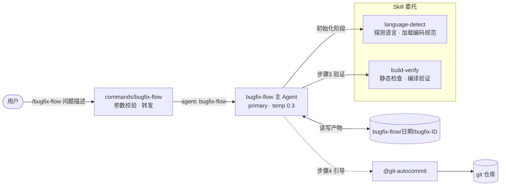
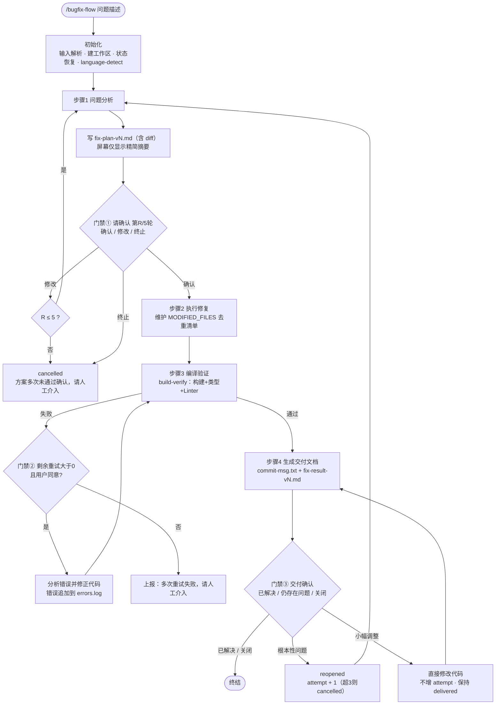
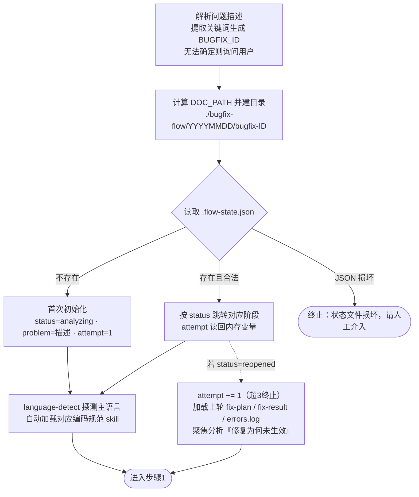
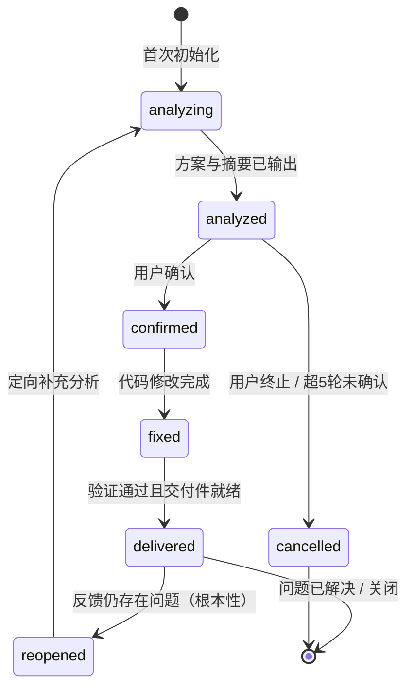

# bugfix-flow Agent 设计文档

> Agent 定义：`.opencode/agents/bugfix-flow/bugfix-flow.md`
> 命令入口：`.opencode/commands/bugfix-flow/bugfix-flow.md`（`/bugfix-flow <问题描述>`）

---

## 1. 概述与核心设计原则

### 1.1 概述

bugfix-flow 是一个**单 Agent 内联式**的完整 Bug 修复流程，覆盖从问题分析到代码提交的全生命周期：

```text
分析根因 → 方案确认 → 执行修复 → 编译验证 → 生成提交信息 → 总结交付
```

用户只需一条命令即可启动：

```bash
/bugfix-flow 登录按钮点击后报 500 错误
```

Agent 自动创建工作区、产出带 diff 的修复方案、等待用户确认、修改代码、调用构建验证，最终生成可直接交给 `@git-autocommit` 的四段式提交信息。

### 1.2 与 dev-flow 的定位对比

| 维度 | bugfix-flow（本文档） | dev-flow |
|------|----------------------|----------|
| 适用场景 | 单个 Bug 修复 | 完整功能开发 |
| 架构模式 | **单 Agent 内联** | 多 Agent 编排（1 主 + 4 子） |
| 执行主体 | bugfix-flow 独立完成全部步骤 | dev-plan / code / review / bugfix 分工协作 |
| 流程规模 | 4 个步骤，分钟级 | 全生命周期，小时级 |
| 上下文传递 | 内存变量 + 状态文件，无跨 Agent 损耗 | 文件路径在子 Agent 间显式接力 |
| 人工交互点 | 3 类门禁（见 §2.3） | 计划确认、审查结论等 |

**选型逻辑**：Bug 修复粒度小、链路短，拆成多 Agent 反而引入上下文传递损耗与编排复杂度。单 Agent 内联让"分析—修复—验证"共享同一份上下文，路径最短、效率最高。

### 1.3 核心设计原则

| # | 原则 | 说明 |
|---|------|------|
| P1 | 内联执行 | 全部逻辑内联在一个 Agent 中，不依赖任何外部 subagent |
| P2 | 状态持久化 | 每次阶段变更同步写入 `.flow-state.json`，支持中断后断点续作 |
| P3 | 人工门禁 | 方案确认、编译重试、交付确认三处必须等用户表态，Agent 不擅自推进 |
| P4 | 有限重试 | 三层上限兜底：方案确认 ≤5 轮、编译重试 ≤2 次、全局修复 ≤3 次，超限一律上报人工 |
| P5 | 产物与代码分离 | 报告文件统一写入 `./bugfix-flow/` 运行目录，不污染源码目录 |
| P6 | 机械可追溯 | 提交信息从报告文件机械提取，保证 commit message 与方案文档一致 |

---

## 2. 架构设计

### 2.1 架构总览

命令入口只做参数校验与转发；主 Agent 内联完成分析/编码/验证逻辑；语言规范与构建验证两项专项能力委托给 Skill；实际 git 提交交由独立的 `@git-autocommit` 完成。



### 2.2 目录结构

**静态定义**（仓库内）：

```text
.opencode/
├── agents/bugfix-flow/
│   └── bugfix-flow.md      # Agent 定义（frontmatter 配置 + 流程提示词）
└── commands/bugfix-flow/
│   └── bugfix-flow.md      # 命令入口：空参数输出用法，否则转发给 @bugfix-flow
├── skills/build-verify/
│   └── SKILL.md            # 构建验证skill：静态检查与编译验证
├── skills/language-detect/
│   └── bugfix-flow.md      # 编码规范探测skill：根据主语言加载对应编码规范
```

**运行产物**（项目根下按需生成）：

```text
./bugfix-flow/
└── 20260824/                       # $DATE，格式 YYYYMMDD
    └── bugfix-login500failed/      # bugfix-$BUGFIX_ID，如 login500failed
        ├── .flow-state.json        # 流程状态（断点恢复依据）
        ├── fix-plan-v1.md          # 修复方案，版本号 = attempt
        ├── errors.log              # 编译错误记录（失败时追加）
        ├── commit-msg.txt          # 四段式提交信息 + 修改文件清单
        └── fix-result-v1.md        # 修复结果 + 验证记录
```

| 产物文件 | 写入时机 | 作用 |
|----------|----------|------|
| `.flow-state.json` | 每次状态变化 | 记录 `status`/`problem`/`attempt`，重启后据此恢复 |
| `fix-plan-v{n}.md` | 步骤 1 | 根因分析、复现流程、**带 diff 的修改点列表**、影响范围 |
| `errors.log` | 步骤 3 失败时 | 编译错误现场，服务当次重试分析与 reopen 补充分析 |
| `commit-msg.txt` | 步骤 4 | 交付物之一，供 `@git-autocommit` 直接使用 |
| `fix-result-v{n}.md` | 步骤 4 | 修复状态、修改文件、构建/类型/Linter 三项验证结论 |

> 版本规则：文件名固定携带 `-v{attempt}` 后缀；`attempt == 1` 时屏幕提示不带标记，否则追加 `(第{n}次修复)`。历史版本永久保留，供 reopen 回溯。

### 2.3 配置属性

来自 Agent frontmatter：

| 配置项 | 取值 | 说明 |
|--------|------|------|
| `mode` | `primary` | 主对话 Agent，直接与用户多轮交互（非 task-only 子代理） |
| `name` | `bugfix-flow` | 注册名，被 command 的 `agent:` 字段引用 |
| `temperature` | `0.3` | 低温度保证根因分析与 diff 修改稳定可复现，保留少量发散空间用于排查思路 |
| `tools` | read / write / edit / bash / webfetch 全开 | 内联架构要求自身具备完整能力：读码分析、改码、跑构建、查资料 |
| `permissions.bash."*"` | `allow` | 放行全部 bash 命令（git / 编译器 / linter 等），风险由 P3/P4 的人工门禁与重试上限补偿 |
| `model` | `opencode/deepseek-v4-flash-free` | 轻量快速模型，匹配流程型任务的成本诉求 |

> ⚠️ 取舍说明：bash 全放行 + 编辑权限意味着 Agent 可直接改动仓库，这是"少摩擦"的有意取舍；安全性依赖三道人工门禁与有限重试机制约束。

---

## 3. 工作流详解

### 3.1 总体流程



各步骤要点：

| 步骤 | 核心动作 | 关键约束 |
|------|----------|----------|
| 1 问题分析 | 首轮完整分析；后续轮次仅针对用户反馈做定向补充 | 修改点必须给出 diff 代码块，纯文字视为无效；输出后**必须停止等待用户** |
| 1.2 方案确认 | 处理 确认/修改/终止 三种反馈 | "修改"累计不超过 5 轮 |
| 2 执行修复 | 按确认方案改码，逐文件登记 | 只改方案内的内容 |
| 3 编译验证 | 复用 build-verify 完整流程 | 失败先记日志，重试前必须征询用户 |
| 4 生成交付文档 | 从报告机械提取素材生成提交信息 | 交付后**不主动结束对话**，等待用户表态 |

### 3.2 初始化阶段（含断点恢复）

初始化遵循**状态恢复优先**原则：先找旧状态文件，再决定是否新建。



### 3.3 状态机

共 7 个状态，其中 `cancelled` 为唯一异常终态：



| status | 含义 | 允许流转 |
|--------|------|----------|
| `analyzing` | 分析中 | → analyzed |
| `analyzed` | 分析完成，待确认 | → confirmed / cancelled |
| `confirmed` | 方案已确认 | → fixed |
| `fixed` | 代码已修复 | → delivered |
| `delivered` | 交付完成 | → reopened / 终结（含小幅调整自循环） |
| `reopened` | 用户反馈仍存在问题 | → analyzing（定向补充分析） |
| `cancelled` | 已终止 | 终态 |

> 注：交付后的"小幅调整"**不改变状态**，Agent 在 `delivered` 内完成"改码 → 重新展示交付确认"的自循环。

### 3.4 关键机制：双计数器

流程中两个计数器独立运作、互不影响，防止无限循环：

| | `attempt`（全局修复尝试） | `$ROUND_COUNT`（方案确认轮次） |
|--|---------------------------|-------------------------------|
| 含义 | 第几次从头修复该 Bug | 当前 attempt 内方案被要求修改的次数 |
| 存储 | 状态文件持久化 | 内存变量（会话恢复时默认 1） |
| 递增时机 | 每次 reopened 进入步骤 1 时 +1 | 用户选择"修改"时 +1 |
| 重置时机 | 从不重置 | 进入新的确认周期时归 1 |
| 上限 | **3 次**，超出 → cancelled，「多次修复仍未解决，请人工介入」 | **5 轮**，超出 → cancelled，「方案多次未通过确认，请人工介入」 |

另有第三处独立上限：**编译验证重试 ≤ 2 次**，且每次重试前需用户同意（见门禁②）。

**交付确认分流规则**（门禁③ 的细分逻辑）：

| 用户反馈 | 判定 | Agent 行为 |
|----------|------|------------|
| 问题已解决 / 关闭 | 正常终结 | 结束对话 |
| 仍存在问题 | 先解释疑问，再主动询问「小幅调整还是根本性问题？」 | —— |
| ├─ 小幅调整 | 局部微调 | 直接改码，**不增 attempt**、保持 `delivered`，改完重回步骤 4 |
| └─ 根本性问题 | 方案方向性错误 | `reopened` → attempt+1 → 回步骤 1 做定向补充分析 |

> ⚠️ 铁律：用户未明确表态前**禁止修改任何代码**。

### 3.5 错误处理与恢复

| 异常场景 | 检测点 | 处置动作 |
|----------|--------|----------|
| 状态文件 JSON 损坏 | 初始化读取失败 | 立即终止：「状态文件损坏，请人工介入」 |
| 方案连续 5 轮未获确认 | `ROUND_COUNT > 5` | `cancelled`：「方案多次未通过确认，请人工介入」 |
| 编译验证连续失败 | 重试 2 次后仍失败 | 上报：「多次重试失败，请人工介入」 |
| 多次修复仍未解决 | reopened 时 `attempt > 3` | `cancelled`：「多次修复仍未解决，请人工介入」 |
| 会话意外中断 | 下次初始化读到合法状态文件 | 按 `status` 跳转到对应阶段继续，`attempt` 从文件恢复 |

恢复设计的四个支点：

1. **恢复优先**：初始化先查状态文件，存在且合法则断点续作，而非盲目新建；
2. **错误留痕**：`errors.log` 同时服务当次重试分析与 reopen 后的历史上下文重建；
3. **产物版本化**：`-v{attempt}` 后缀保留每一轮方案与结果，reopen 时可完整回溯上一轮决策；
4. **终态收敛**：所有路径只有两种结局——正常终结，或带着明确原因「请人工介入」，不存在静默失败。
