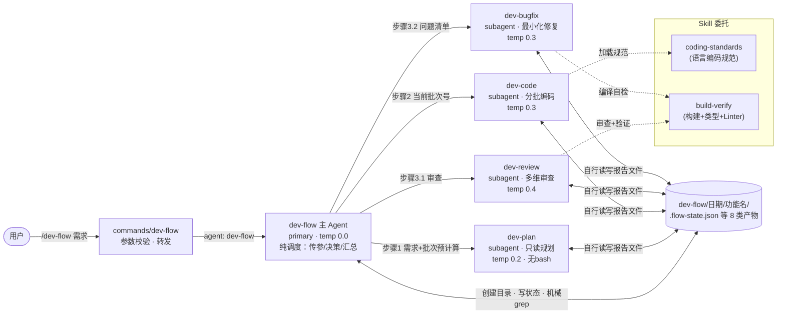
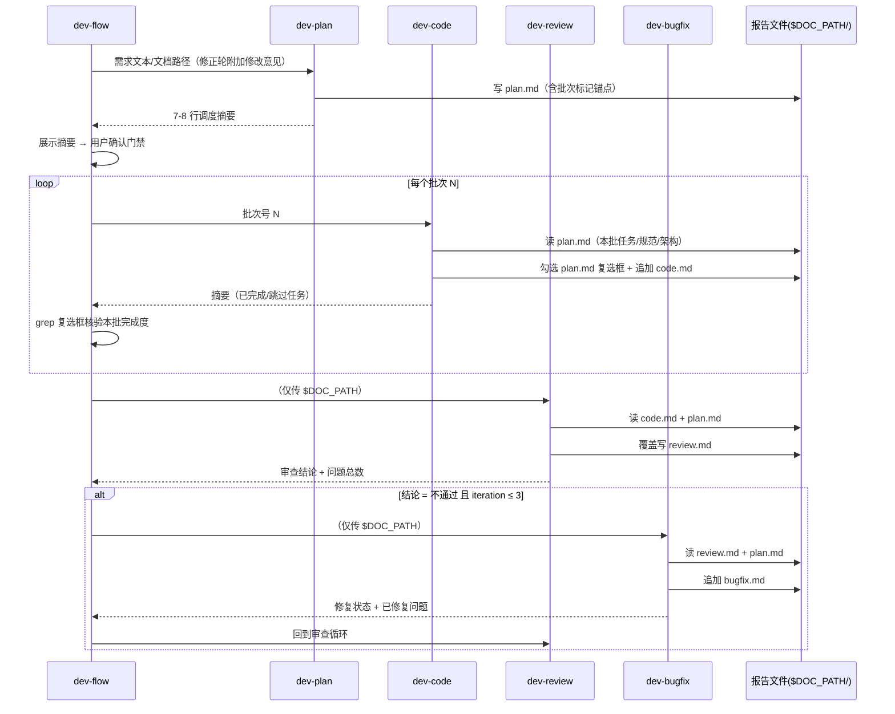
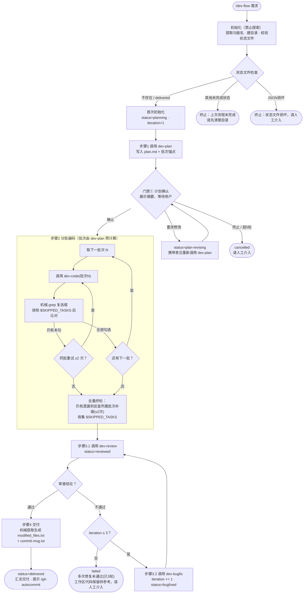
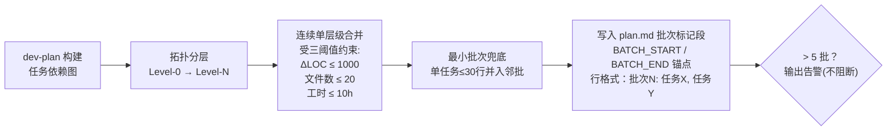
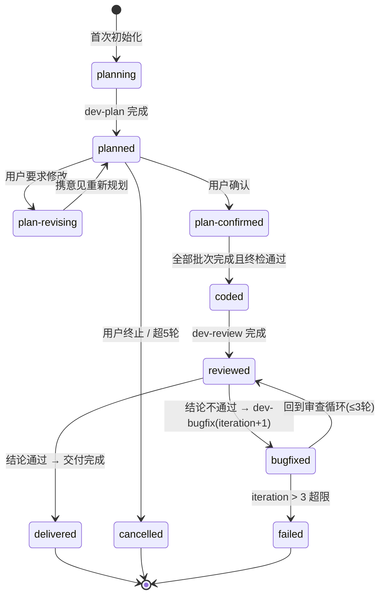

# dev-flow Agent 设计文档

> Agent 定义：`.opencode/agents/dev-flow/dev-flow.md`（主调度）+ 同目录下 `dev-plan.md` / `dev-code.md` / `dev-review.md` / `dev-bugfix.md`（子代理）
> 命令入口：`.opencode/commands/dev-flow/dev-flow.md`（`/dev-flow <需求描述 | 需求文档路径>`）

---

## 1. 概述与核心设计原则

### 1.1 概述

dev-flow 是一个**多 Agent 编排式**的全流程开发管线，覆盖从需求分析到成果交付的完整生命周期：

```text
需求规划 → 计划确认 → 分批编码 → 审查 → BUG修复(循环) → 交付
```

用户只需一条命令即可启动：

```bash
/dev-flow 实现用户登录功能          # 直接给需求描述
/dev-flow dev-flow/20260824/用户登录/brainstorm.md   # 或给需求文档路径
```

主 Agent `dev-flow` 本身**不懂代码**，它是纯调度器：把任务按顺序分派给 4 个专业子代理，通过文件传递上下文，用机械规则（grep 复选框、读状态字段）判断流程走向。

### 1.2 与 bugfix-flow 的定位对比

| 维度 | dev-flow（本文档） | bugfix-flow |
|------|-------------------|-------------|
| 适用场景 | 完整功能开发（从零到交付） | 单个 Bug 修复 |
| 架构模式 | **多 Agent 编排**（1 主 + 4 子） | 单 Agent 内联 |
| 执行主体 | plan / code / review / bugfix 分工协作 | bugfix-flow 独立完成全部步骤 |
| 流程规模 | 全生命周期，小时级、多批次 | 4 个步骤，分钟级 |
| 人工交互点 | 计划确认门禁（≤5 轮） | 方案确认、重试征询、交付确认 |
| 核心难点 | 跨 Agent 上下文传递与完成度判定 | 根因分析深度 |

### 1.3 核心设计原则

| # | 原则 | 说明 |
|---|------|------|
| P1 | 纯调度器 | dev-flow作为主Agent，只做三件事：**传参、决策、汇总**。禁止读取源码、评判方案、分析 git diff——所有技术判断下放给子代理 |
| P2 | 文件即契约 | 子Agent间不通过上下文字段传递信息，而是各自读写 `$DOC_PATH/` 下的报告文件；**plan.md 是唯一真理来源（SSOT）**，语言/框架/架构/验收条件均以它为准 |
| P3 | 批次预计算 | 批次划分由 dev-plan 在规划阶段完成并写入标记锚点，dev-flow 只做机械解析与按序调度，不做语义级分批决策 |
| P4 | 机械可判定 | 所有"检查"限定为机械操作：grep 复选框计数、读 `status:` 字段、统计行数。杜绝"检查结果"这类可被解释为质量评判的模糊措辞 |
| P5 | 人工门禁 | 计划必须经用户确认才能编码；Agent 不擅自推进关键节点 |
| P6 | 有限重试 | 三层上限兜底：计划确认 ≤5 轮、同批编码重试 ≤2 次、修复循环 ≤3 轮，超限一律上报「请人工介入」 |
| P7 | 产物与代码分离 | 报告文件统一写入 `./dev-flow/` 运行目录，不污染源码目录 |

---

## 2. 架构设计

### 2.1 多 Agent 架构总览

命令入口只做空参数校验与转发；主 Agent 负责编排；4 个子代理各司其职；构建验证等专项能力委托给 Skill。



**职责分工一览**：

| Agent | mode | 一句话职责 | 明确不做 |
|-------|------|-----------|---------|
| dev-flow | primary | 调度、状态机流转、机械核验、汇总交付 | 读源码、评方案、析 diff |
| dev-plan | subagent | 现状分析、架构设计、任务拆分、**计算批次** | 改项目代码 |
| dev-code | subagent | 按批编码、语法自检、勾选任务复选框 | 加未规划功能 |
| dev-review | subagent | 多维审查、分级问题清单、构建测试验证 | 改项目代码 |
| dev-bugfix | subagent | 根因定位、最小化修复、回归验证 | 重构无关代码 |

### 2.2 通信架构：文件即契约

子代理之间**不直接对话、不共享上下文**，全部通过 `$DOC_PATH/` 下的文件接力。dev-flow 不做字段级解析，只传递文件路径和批次号。



**信息契约表**（dev-flow 视角，只关心路径与状态字段）：

| 步骤 | 子代理 | dev-flow 传入 | 子代理自行读取 | 子代理写回 | 返回摘要关键字段 |
|------|--------|--------------|---------------|-----------|----------------|
| 规划 | @dev-plan | 需求文本或文档路径；修正轮附修改意见 | 需求文档、项目现状 | `plan.md`（覆盖） | 计划状态/批次数/任务总数/技术选型/关键风险 |
| 编码 | @dev-code | 当前批次号 | `plan.md` | `code.md`（追加）+ 勾选 `plan.md` 复选框 | 编写状态/已完成/未完成/**跳过任务** |
| 审查 | @dev-review | —（自取上下文） | `code.md` + `plan.md` | `review.md`（覆盖） | 审查结论/问题分级统计 |
| 修复 | @dev-bugfix | —（自取上下文） | `review.md` + `plan.md` | `bugfix.md`(追加) | 修复状态/已修复问题/修改文件 |

> 一致性保障：如需增减字段，只需改对应子代理的定义文件，dev-flow 无需变更——因为 dev-flow 从不解析报告内容，只 grep 锚点（`<!-- BATCH_START -->`、`- [x]`、`status:`）。

### 2.3 目录结构

**静态定义**（仓库内）：

```text
.opencode/
├── agents/dev-flow/
│   ├── dev-flow.md       # 主调度 Agent（frontmatter 配置 + 流程提示词）
│   ├── dev-plan.md       # 子代理：只读规划 + 批次预计算
│   ├── dev-code.md       # 子代理：分批编码
│   ├── dev-review.md     # 子代理：多维审查 + 构建验证
│   └── dev-bugfix.md     # 子代理：根因修复
└── commands/dev-flow/
    └── dev-flow.md       # 命令入口：空参输出用法，否则转发 @dev-flow
```

**运行产物**（项目根下按需生成）：

```text
./dev-flow/
└── 20260824/                     # $DATE，格式 YYYYMMDD
    └── 用户登录/                  # $FEATURE_NAME 功能名称
        ├── .flow-state.json      # 流程状态（iteration + status）
        ├── plan.md               # 开发计划 = SSOT（含批次标记锚点）
        ├── code.md               # 编码成果报告（逐批次追加）
        ├── review.md             # 审查报告（每轮覆盖）
        ├── bugfix.md             # 修复报告（逐轮追加）
        ├── skipped_tasks.txt     # 跳过任务清单（有跳过时生成）
        ├── modified_files.txt    # 合并去重的改动文件清单
        └── commit-msg.txt        # 提交信息素材（需求概述/修改说明/测试建议）
```

| 产物文件 | 写入者 | 写入时机 | 作用 |
|----------|--------|----------|------|
| `.flow-state.json` | dev-flow | 每次状态变化 | 记录 `iteration`/`status`，重启后据此校验与恢复 |
| `plan.md` | dev-plan | 规划/修正轮覆盖 | SSOT：技术选型、架构、任务复选框、批次锚点，供 code/review/bugfix 共享 |
| `code.md` | dev-code | 每批完成后追加 | 功能→涉及文件映射、依赖记录、任务完成度，供审查与交付提取 |
| `review.md` | dev-review | 每轮审查覆盖 | 分级问题清单（C/M/m/P + ID）、验证清单、审查结论 |
| `bugfix.md` | dev-bugfix | 每轮修复追加 | 根因分析、已修复/未修复问题、修改文件列表 |
| `skipped_tasks.txt` | dev-flow | 终检发现跳过项时 | 交付时向用户明示哪些任务被放弃及原因 |
| `modified_files.txt` | dev-flow | 步骤4 交付时 | 从 code.md/bugfix.md 机械合并的改动文件全集 |
| `commit-msg.txt` | dev-flow | 步骤4 交付时 | 从 plan.md 机械提取的提交信息素材（需求概述/修改说明/测试建议），配合 `/git-autocommit` |

### 2.4 配置属性

五个 Agent 的 frontmatter 对比：

| 配置项 | dev-flow | dev-plan | dev-code | dev-review | dev-bugfix |
|--------|----------|----------|----------|------------|------------|
| `mode` | **primary** | subagent | subagent | subagent | subagent |
| `temperature` | **0.0** | 0.2 | 0.3 | **0.4** | 0.3 |
| `read` | ✓ | ✓ | ✓ | ✓ | ✓ |
| `write` / `edit` | ✓ / ✓ | ✓ / ✓ | ✓ / ✓ | ✓ / ✓ | ✓ / ✓ |
| `bash` | ✓ | **✗** | ✓ | ✓ | ✓ |
| `webfetch` | ✓ | ✓ | ✓ | ✗ | ✗ |
| `permissions` | bash 全放行 | （无显式配置） | write/edit/bash 放行 | **all: ask** + bash 放行 | edit/bash 放行 |
| `model` | deepseek-v4-flash-free | 同左 | 同左 | 同左 | 同左 |

**温度梯度设计意图**——按"创造性需求"递增分配：

```text
dev-flow 0.0 ──── 调度必须完全确定，温度非零会导致流程抖动
dev-plan 0.2 ──── 规划需结构化输出，保留少量发散用于方案探索
dev-code 0.3 ──── 编码需要适度灵活应对实现细节
dev-bugfix 0.3 ── 修复需在"最小改动"约束内灵活尝试替代方案
dev-review 0.4 ── 审查需要最大发散度，主动发掘清单之外的问题
```

**权限取舍说明**：

- dev-flow/bash 全放行但提示词严禁读源码——它只需要 mkdir/echo/grep 等机械命令；
- dev-plan 是唯一禁用 bash 的角色——只读规划不允许执行任何命令；
- dev-review 设置 `all: ask` 兜底（除 bash 外的新工具默认询问），因为它要跑构建/测试，动作最多；
- 所有角色均可写 `$DOC_PATH/` 报告文件，但只有 dev-code 和 dev-bugfix 允许修改项目源码。

---

## 3. 工作流详解

### 3.1 总体流程



各步骤要点：

| 步骤 | 核心动作 | 关键约束 |
|------|----------|----------|
| 初始化 | 提取功能名→建目录→写状态文件→校验旧状态 | **禁止探索**：不许 Read/Glob/Grep 项目，范围由 dev-plan 自行决策 |
| 1 规划 | 判断需求来源（文本 or 文档路径），全量传给 dev-plan | dev-flow 不预设任何技术方案 |
| 1.2 计划确认 | 展示摘要关键字段，处理 确认/修改/终止 | "修改"累计 ≤5 轮；dev-flow 只转述意见不评判优劣 |
| 2 分批编码 | 解析批次锚点→逐批调度→grep 核验→全量终检 | 第一批未完成不开第二批；同批重试不计迭代、≤2 次 |
| 3 审查修复 | 审查→结论分流→修复→回审 | 修复循环 ≤3 轮；超限置 `failed` 并保留现场 |
| 4 交付 | 机械合并文件清单、提取提交信息素材 | 严禁分析源码/diff 生成 commit message，素材只来自报告文件 |

### 3.2 关键机制一：批次预计算与机械核验

批次划分发生在**规划阶段**而非编码阶段，彻底消除调度器的语义判断：



锚点格式固定，供 dev-flow 机械解析：

```text
<!-- BATCH_START -->
批次1: 任务A-1, 任务A-2, 任务A-3
批次2: 任务B-1
<!-- BATCH_END -->
```

**批次完成判定**（纯 grep，无语义理解）：

1. dev-code 每完成一个任务，将 `- [ ] 任务X` 原地替换为 `- [x] 任务X`（保留原文保证可匹配）；
2. dev-flow 收到返回摘要后，把摘要中的**跳过任务**追加进全局集合 `$SKIPPED_TASKS`（跳过 ≠ 失败，不触发重试）；
3. 对 plan.md 执行 grep：排除 `$SKIPPED_TASKS` 后，本批 `- [ ]` 数为 0 → 完成；否则同批重调 dev-code（≤2 次）。

### 3.3 状态机

共 10 个状态，其中 `delivered` 为正常终态，`cancelled` / `failed` 为异常终态：



| status | 含义 | 允许流转 |
|--------|------|----------|
| `planning` | 初始化完成，规划中 | → planned |
| `planned` | 计划已产出，待确认 | → plan-confirmed / plan-revising / cancelled |
| `plan-revising` | 用户要求修改计划 | → planned（携意见重规划） |
| `plan-confirmed` | 计划已确认 | → coded |
| `coded` | 全部批次编码完毕 | → reviewed |
| `reviewed` | 本轮审查完成 | → bugfixed / delivered |
| `bugfixed` | 本轮修复完成 | → reviewed（回审） / failed |
| `delivered` | 交付完成 | **正常终态**（重启时视为全新流程） |
| `cancelled` | 用户终止或确认超限 | 异常终态 |
| `failed` | 修复循环超限 | 异常终态（工作区代码保留） |

> 启动校验规则：读到 `delivered` 按新流程执行；读到其他任何状态 → 「上次流程未完成，请先清理目录」终止。即**不支持跨会话断点续作**，以干净目录保证状态一致性。

### 3.4 关键机制二：双计数器

两个计数器独立运作、互不影响，防止无限循环：

| | `iteration`（修复迭代） | 同批重试（临时计数） |
|--|------------------------|---------------------|
| 含义 | 审查→修复→回审 循环的轮数 | 同一批次内重调 dev-code 的次数 |
| 存储 | `.flow-state.json` 持久化 | 内存变量（批次切换即归零） |
| 初值 | 1 | 0 |
| 递增时机 | 每次 dev-bugfix 完成后 +1 | 同批 grep 核验失败后 +1 |
| 上限 | **3 轮**（iteration > 3 → failed） | **2 次**（超限进入全量终检反查） |
| 特殊性 | 全局计数，贯穿整个生命周期 | 不计入 iteration，批次粒度独立 |

另有第三处独立上限：**计划确认 ≤5 轮**（门禁① 内自循环计数）。

### 3.5 错误处理与恢复

| 异常场景 | 检测点 | 处置动作 |
|----------|--------|----------|
| 状态文件 JSON 损坏 | 启动校验解析失败 | 立即终止：「状态文件损坏，请人工介入」 |
| 上次流程未完成 | 启动校验发现非 delivered/cancelled/failed 状态 | 终止：「请先清理 $DOC_PATH/ 目录后重试」 |
| 计划连续 5 轮未获确认 | 门禁① 计数超限 | `cancelled`：「计划多次未通过确认，请人工介入」 |
| 用户主动终止 | 门禁① 反馈"终止" | `cancelled`，正常收尾 |
| 同一批次反复编不完 | 同批重试 >2 次 | 跳出批次循环，进入全量终检反查所属批次再补做（仍 ≤2 次） |
| 任务无法完成 | dev-code 摘要明确声明跳过 | 加入 `$SKIPPED_TASKS`，**不触发重试**，交付时随 `skipped_tasks.txt` 向用户明示 |
| 修复 3 轮仍不通过 | `iteration > 3` | `failed`：「多次修复未通过（已执行 3 轮），请人工介入，工作区代码已保留供参考」 |

**容错设计的四个支点**：

1. **状态前置校验**：启动即拦截脏状态（损坏/未完成），绝不在不一致基础上推进；
2. **跳过优于卡死**：明确声明无法完成的任务被显式登记并透传到交付，而不是让流程原地空转；
3. **分层重试**：批次级重试（≤2）与全局修复循环（≤3）相互隔离，局部失败不会耗尽全局机会；
4. **终态收敛**：所有路径只有三种结局——`delivered` 正常交付，或 `cancelled`/`failed` 带着明确原因「请人工介入」，不存在静默失败。
