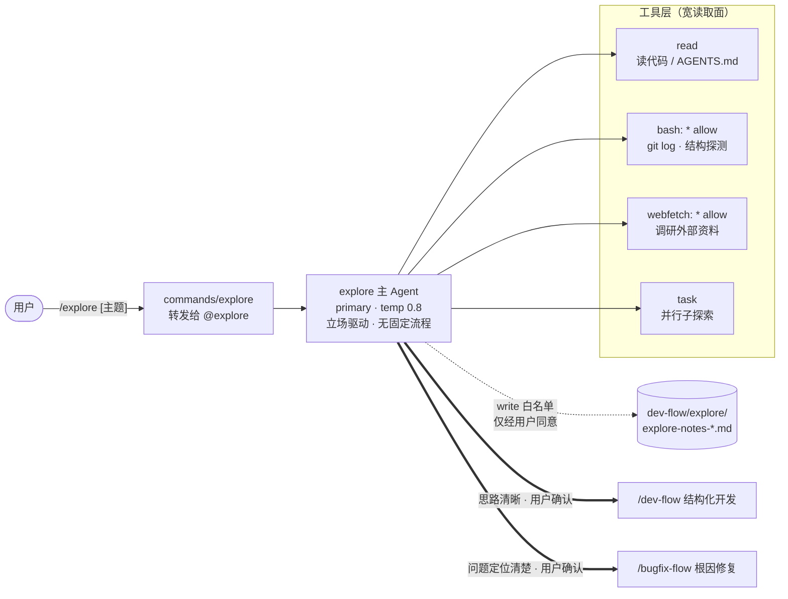
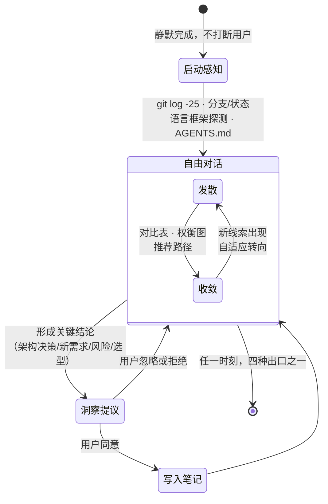
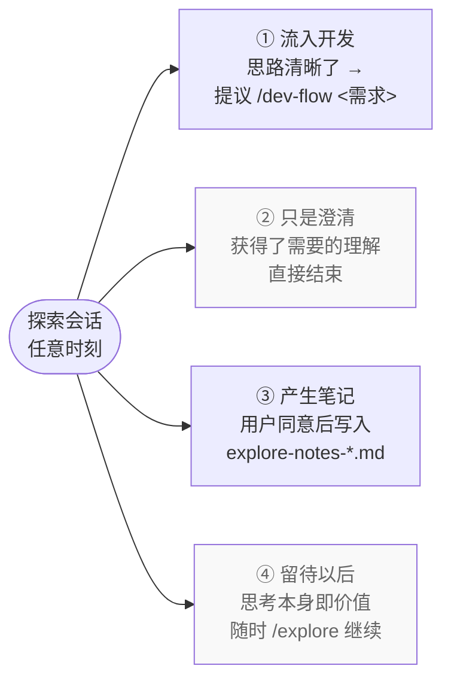
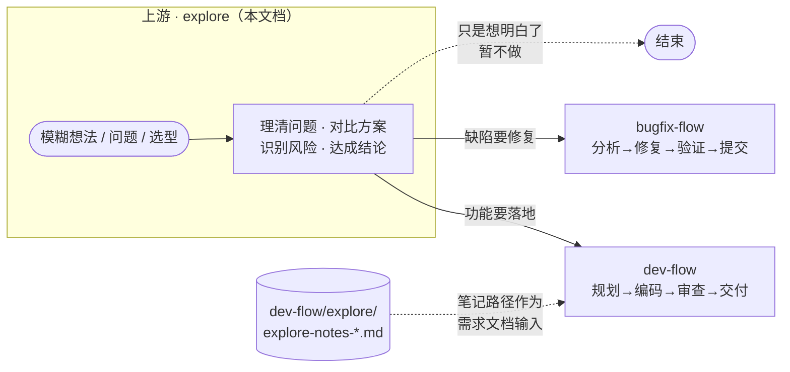

# explore Agent 设计文档

> Agent 定义：`.opencode/agents/explore/explore.md`
> 命令入口：`.opencode/commands/explore/explore.md`（`/explore [探索主题]`）

---

## 1. 概述与核心设计原则

### 1.1 概述

explore 是一个**自由探索模式**：深度思考、问题分析、选项对比。它是**思考伙伴，不是实现工具**。

用户一条命令即可进入：

```bash
/explore                                    # 空：agent 自行感知项目后主动开题
/explore 实时协作功能怎么设计                 # 模糊想法
/explore postgres vs sqlite 选哪个           # 技术选型
/explore 认证系统越来越难维护了               # 具体问题
/explore 登录流程怎么走的                     # 代码疑问
```

它最特殊的一点：**这是一种立场（stance），不是工作流（workflow）**——没有固定步骤、没有强制序列、没有必须产出。

### 1.2 在四个 flow 中的定位

四个 flow 按"结构化程度"排成一条光谱：

```text
结构化程度 ◀──────────────────────────────────────────────▶ 强结构

┌───────────────┬──────────────────┬──────────────────────┐
│ explore  │ bugfix-flow      │ review-flow          │
│               │                  │ dev-flow             │
├───────────────┼──────────────────┼──────────────────────┤
│ 立场驱动       │ 单 Agent 内联     │ 多 Agent 编排         │
│ 零步骤·零门禁  │ 4 步骤 · 3 类门禁 │ 状态机 · 批次 · 门禁   │
│ 无必须产物     │ 分钟级            │ 小时级                │
│ 温度 0.8 发散  │ 温度 0.2~0.3 收敛 │ 主控温度 0.0 机械调度  │
└───────────────┴──────────────────┴──────────────────────┘
        ▲ 探索"做什么、为什么"          解决"怎么做、做出来"
```

一句话分工：**explore 负责把问题想清楚，其余三个 flow 负责把事情做完**。

### 1.3 核心设计原则

| # | 原则 | 说明 |
|---|------|------|
| P1 | 思考而非实现 | 永不写应用代码；write 权限仅限探索笔记目录，源代码零写入 |
| P2 | 立场驱动 | 好奇而非说教、开放而非审讯、自适应转向，不照脚本念 |
| P3 | 接地探索 | 读真实代码库、git 历史，画真实架构图，不只纸上谈兵 |
| P4 | 可视化优先 | 大量使用 ASCII 图（架构草图、状态机、对比表、调用链）理清思路 |
| P5 | 提议式捕获 | 有价值的洞察只口头提议记录，**绝不自动写入** |
| P6 | 明确跃迁边界 | 即使用户说"就按这个做"，也必须先确认退出探索模式才能进开发流程 |

---

## 2. 架构设计

### 2.1 架构总览

单 primary Agent，无子代理编排。能力全部来自工具组合，写入面被权限白名单收敛到唯一点。



### 2.2 目录结构

**静态定义**（仓库内，共 2 个文件）：

```text
.opencode/
├── agents/explore/
│   └── explore.md        # Agent 定义（frontmatter 配置 + 立场提示词）
└── commands/explore/
    └── explore.md        # 命令入口：/explore [主题] → 转发 @explore
```

**运行产物**（项目根下按需生成，全 Agent 唯一可写区）：

```text
./dev-flow/explore/
└── explore-notes-2026-08-24-auth-refactor.md
#   └── explore-notes-{YYYY-MM-DD}-{topic-slug}.md
```

| 要素 | 规则 |
|------|------|
| 写入时机 | 仅当讨论中自然形成有价值结论 **且用户明确同意** 后才创建 |
| 文件格式 | YAML frontmatter 标记 `date` / `topic`，正文自由格式，**不套模板** |
| 下游用途 | 文件路径可作为 `/dev-flow <需求文档路径>` 的输入 |

### 2.3 配置属性

来自 Agent frontmatter：

| 配置项 | 取值 | 说明 |
|--------|------|------|
| `mode` | `primary` | 主对话 Agent，直接与用户多轮交互 |
| `temperature` | `0.8` | 四个 flow 中最高，利于发散思维与头脑风暴（对比 dev-flow 主控 0.0、bugfix-flow 0.3、review-flow 0.2） |
| `model` | `opencode-go/deepseek-v4-flash` | 轻量快速模型，匹配探索对话高频低风险的特点 |
| `tools` | read / bash / webfetch / write / task 全开 | 五类工具齐备，支撑"查码 + 调研 + 并行研究" |
| `permissions.bash` | `"*": "allow"` | git 历史、目录扫描等探测命令免确认 |
| `permissions.webfetch` | `"*": "allow"` | 外部技术调研免确认 |
| `permissions.write` | 仅 `"dev-flow/explore/*": "allow"` | **关键安全设计**：写操作收敛到探索笔记单一白名单路径 |

权限设计的核心是**宽读取、窄写入的漏斗形**：

```text
读取面（宽，免确认）                写入面（窄，双保险）
┌─────────────────────┐           ┌──────────────────────┐
│ read  bash *        │  全库可见  │ write ──▶ 提议 → 用户 │
│ webfetch *  task    │  ───────▶ │ 同意 ──▶ 仅允许写入    │
└─────────────────────┘           │ dev-flow/explore/*    │
                                  └──────────────────────┘
                                        源代码零写入
```

---

## 3. 工作流详解

### 3.1 为什么说它"不是工作流"

dev-flow / bugfix-flow / review-flow 都有状态机、门禁和必产文件；explore 刻意全部放弃：

| 维度 | 其余三个 flow | explore |
|------|--------------|--------------|
| 流程形态 | 固定步骤序列 | 自由对话，跟随话题漂移 |
| 状态机 / 状态文件 | `.flow-state.json` 断点续作 | 无，会话即状态 |
| 人工门禁 | 方案确认等强制关卡 | 无门禁，只有出口提议 |
| 必须产物 | plan.md / fix-result.md 等 | 无必须产出，笔记可选 |
| 结束条件 | 交付 / 回滚等明确终点 | 没有固定终点，随时可走可留 |

### 3.2 交互模型

虽然没有流程，但每次调用有一个轻量的**感知—对话循环**：



两个要点：

- **启动感知是静默的**：agent 先自行摸清项目背景再接话，用户看不到原始输出；
- **发散⇄收敛交替**：同时抛出多个有趣方向让用户选（发散），选定后用图表深挖（收敛），新信息出现即转回发散。

对话中的典型动作：澄清提问、挑战假设、重新框定问题、绘制 ASCII 架构图、构建选项对比表、暴露风险与未知、用 Task 工具并行研究多条线索。

### 3.3 结束方式：没有终点，只有四种出口



注意出口①的守护规则：即使探索中已经达成一致，agent 也**不会直接开工**，而是问："要退出探索模式，通过 `/dev-flow <需求描述>` 进入结构化开发吗？" —— 明确确认后才发生模式跃迁（P6）。

### 3.4 作为 dev-flow / bugfix-flow 的前置步骤

explore 位于所有执行流程的上游，负责"想清楚"，再把接力棒交给"做出来"的 flow：



**上下文如何交接给下游**（松耦合，两种方式）：

| 交接方式 | 用法 | 说明 |
|----------|------|------|
| 显式交接 | `/dev-flow dev-flow/explore/explore-notes-2026-08-24-auth-refactor.md` | 探索笔记直接作为需求文档输入，与 brainstorm.md 同位 |
| 口头交接 | `/dev-flow 实现基于 Postgres 的会话存储` | 探索中达成的结论由用户复述为需求描述 |

**与 bugfix-flow 的关系**：修复前先用 `/explore 登录报 500 是怎么回事` 把根因和影响面讨论清楚，再带着结论进入 `/bugfix-flow`，可显著减少方案返工。

> 松耦合说明：下游 flow **并不依赖**探索笔记存在——没做过探索也能直接启动 dev-flow / bugfix-flow；笔记只是提升输入质量的可选加速器。
