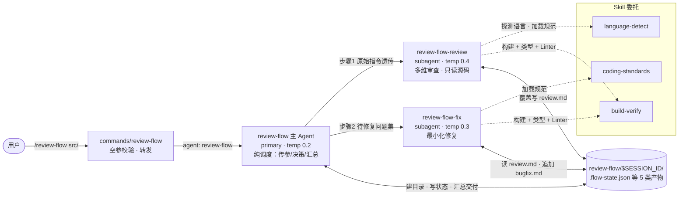
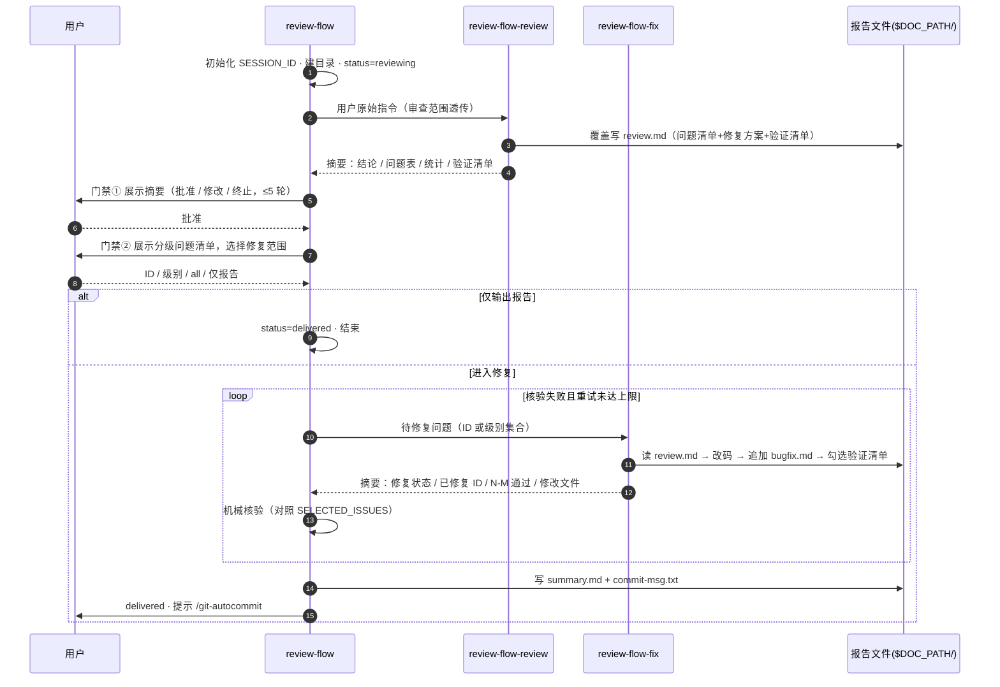
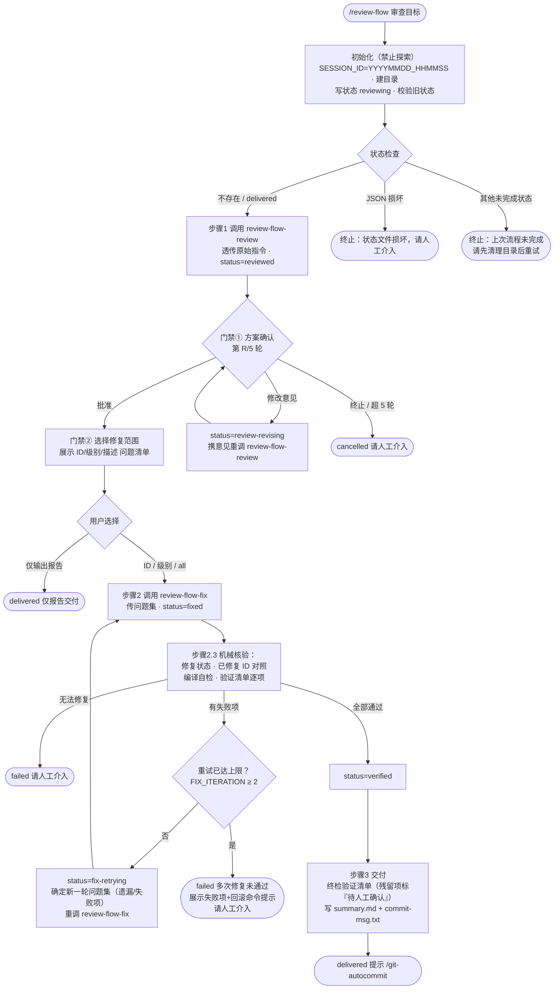
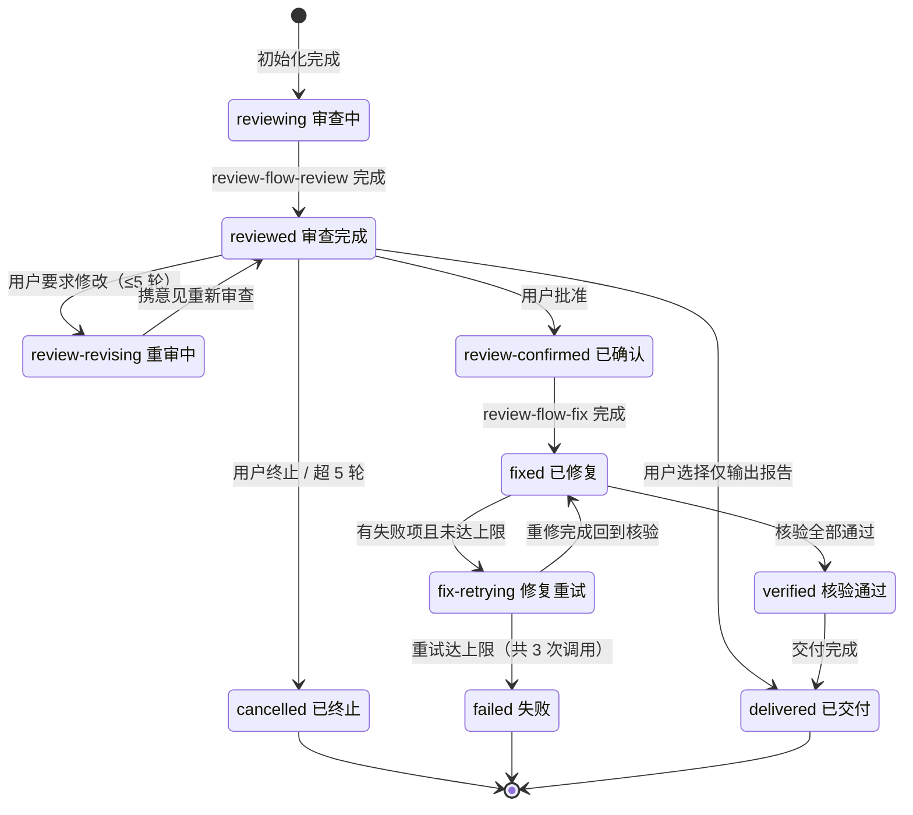

# review-flow Agent 设计文档

> Agent 定义：`.opencode/agents/review-flow/review-flow.md`（主调度）+ 同目录下 `review-flow-review.md`（审查子代理）/ `review-flow-fix.md`（修复子代理）
> 命令入口：`.opencode/commands/review-flow/review-flow.md`（`/review-flow <审查目标路径>`）

---

## 1. 概述与核心设计原则

### 1.1 概述

review-flow 是一个**多 Agent 编排式**的代码审查与修复管线，覆盖存量代码从审查到修复交付的完整生命周期：

```text
代码审查 → 分级问题清单 → 方案确认 → 选择修复范围 → 最小化修复(循环) → 验证交付
```

用户只需一条命令即可启动：

```bash
/review-flow src/                      # 审查整个目录
/review-flow src/auth.ts src/models/   # 或指定若干文件
```

主 Agent `review-flow` 本身**不懂代码**——五条红线禁止它读源码、扫目录、定范围、代执行、解析报告。它只做三件事：把用户原始指令透传给审查子代理、根据返回摘要与用户表态决定下一步、归集摘要生成交付件。所有技术判断都发生在子代理内部。

### 1.2 与 dev-flow / bugfix-flow 的定位对比

| 维度 | review-flow（本文档） | dev-flow | bugfix-flow |
|------|----------------------|----------|-------------|
| 适用场景 | 存量代码审查 + 定向修复 | 从零开发完整功能 | 已知单个 Bug 修复 |
| 输入 | 审查目标路径 | 需求描述或文档路径 | 问题描述 |
| 架构模式 | 多 Agent 编排（1 主 + 2 子） | 多 Agent 编排（1 主 + 4 子） | 单 Agent 内联 |
| 核心产出 | review.md + bugfix.md + summary.md | plan/code/review 全套产物 | fix-plan / fix-result |
| 特色机制 | 问题分级自选修复、仅报告模式、SSOT 双向读写 | 批次预计算、全量终检 | 版本化产物、reopen |

### 1.3 核心设计原则

| # | 原则 | 说明 |
|---|------|------|
| P1 | 纯调度器 + 五条红线 | review-flow作为主Agent，不读任何源码、不扫描项目结构、不自定审查范围、不代替子代理执行、不读取子代理报告文件——违反立即终止并输出 `SELF_CHECK_FAILED` |
| P2 | 文件即契约 | 子Agent间通过 `$DOC_PATH/` 下文件接力，主 Agent 不做字段级解析；**review.md 是唯一真理来源（SSOT）**，增减字段只需改对应子代理定义，无需动 review-flow |
| P3 | 范围自治 | 审查范围由 review-flow-review 自行决策，review-flow 仅透传用户原始指令 |
| P4 | 双人工门禁 | 门禁① 方案确认、门禁② 修复范围选择——未经用户表态不动一行代码 |
| P5 | 有限重试 | 两层上限兜底：方案确认 ≤5 轮、修复重试 ≤2 次（累计最多 3 次修复调用），超限一律上报「请人工介入」 |
| P6 | 产物与代码分离 | 报告统一写入 `./review-flow/$SESSION_ID/` 运行目录，按会话隔离，不污染源码目录 |
| P7 | 机械可追溯 | summary.md 与 commit-msg.txt 均从子代理返回摘要机械提取，不引入主观再创作 |

---

## 2. 架构设计

### 2.1 多 Agent 架构总览

命令入口只做空参校验与转发；主 Agent 负责编排与门禁交互；2 个子代理各司其职；语言规范与构建验证两项专项能力委托给 Skill。



**职责分工一览**：

| Agent | mode | 一句话职责 | 明确不做 |
|-------|------|-----------|---------|
| review-flow | primary | 传参、门禁交互、状态机流转、机械核验、汇总交付 | 读源码、定范围、解析报告内容 |
| review-flow-review | subagent | 范围决策、多维审查、分级问题清单 + 修复方案 + 验证清单 | 修改项目代码（edit 禁用） |
| review-flow-fix | subagent | 按 FixPlan 最小化修复、编译自检、更新验证清单 | 引入新功能、重构无关代码 |

### 2.2 通信架构：文件即契约

子代理之间**不直接对话、不共享上下文**，全部通过 `$DOC_PATH/` 下的文件接力。review-flow 不解析报告内容，只在 prompt 中传递原始指令和问题 ID 集合。



**信息契约表**（review-flow 视角，只关心路径与摘要状态字段）：

| 步骤 | 子代理 | review-flow 传入 | 子代理自行读取/决策 | 写回文件 | 返回摘要关键字段 |
|------|--------|-----------------|--------------------| ---------|----------------|
| 审查 | @review-flow-review | 用户原始指令（原样透传） | 审查目标源码、language-detect / 编码规范 / build-verify skills、默认范围自行扫描决策 | `review.md`（覆盖） | 审查结论 / 范围 / 规范 / 问题清单（ID·级别·描述·位置）及分级统计 / 验证清单 |
| 修复 | @review-flow-fix | 待修复问题集合（ID / 级别 / all） | `review.md`（SSOT）、源码上下文、build-verify | `bugfix.md`（追加）+ 勾选 `review.md` 验证清单 | 修复状态 / 已修复 ID / 编译自检 / 验证清单 N-M / 修改文件列表 / 原因·说明·测试建议摘要 |

> 一致性保障：如需增减字段，只需改对应子代理的定义文件，review-flow 无需变更——因为它从不解析报告内容，只消费子代理返回的摘要文本。

### 2.3 目录结构

**静态定义**（仓库内）：

```text
.opencode/
├── agents/review-flow/
│   ├── review-flow.md          # 主调度 Agent（frontmatter 配置 + 流程提示词）
│   ├── review-flow-review.md   # 子代理：多维审查 + 分级问题清单
│   └── review-flow-fix.md      # 子代理：最小化修复 + 编译自检
└── commands/review-flow/
    └── review-flow.md          # 命令入口：空参输出用法，否则转发 @review-flow
```

**运行产物**（项目根下按需生成，按会话隔离）：

```text
./review-flow/
└── 20260824_143025/           # $SESSION_ID，格式 YYYYMMDD_HHMMSS
    ├── .flow-state.json       # 流程状态（断点校验依据）
    ├── review.md              # 审查报告 = SSOT（每轮覆盖；fix 会勾选其中验证清单）
    ├── bugfix.md              # 修复报告（追加累积多轮）
    ├── summary.md             # 交付汇总：审查概览 + 验证结果
    └── commit-msg.txt         # 四段式提交信息（仅有代码修改时生成）
```

| 产物文件 | 写入者 | 写入时机 | 作用 |
|----------|--------|----------|------|
| `.flow-state.json` | review-flow | 每次状态变化 | 记录 `status`，重启后据此校验会话是否干净 |
| `review.md` | review-flow-review（覆盖）<br>review-flow-fix（勾选复选框） | 每轮审查覆盖；修复后更新 | SSOT：问题清单（含修复前后 diff）+ 修复方案 + 验证清单，被 review 与 fix 双向读写 |
| `bugfix.md` | review-flow-fix | 每轮修复追加 | 修复记录累积：已修复/未修复问题、修改文件、验证结果 |
| `summary.md` | review-flow | 步骤3 交付时 | 会话概览（范围、问题统计、已修复/未修复、涉及文件）+ 验证结论 |
| `commit-msg.txt` | review-flow | 有修改的交付时 | 四段式提交信息（来源/原因/修改说明/测试建议），配合 `/git-autocommit` |

### 2.4 配置属性

三个 Agent 的 frontmatter 对比：

| 配置项 | review-flow | review-flow-review | review-flow-fix |
|--------|-------------|--------------------|-----------------|
| `mode` | **primary** | subagent | subagent |
| `temperature` | **0.2** | **0.4** | 0.3 |
| read / write / edit / bash | ✓ / ✓ / ✓ / ✓ | ✓ / ✓ / **✗** / ✓ | ✓ / ✓ / ✓ / ✓ |
| `webfetch` | ✓ | ✗ | ✗ |
| `permissions` | bash 全放行 | **all: ask** + write 放行 + bash 放行 | edit / bash 放行 |
| `model` | opencode-go/deepseek-v4-flash | 同左 | 同左 |

**温度梯度设计意图**——按"创造性需求"递增分配：

```text
review-flow        0.2 ── 调度与转述需稳定，低发散保证流程确定性与门禁判断一致
review-flow-fix    0.3 ── 在"最小改动"约束内保留灵活度，尝试替代修复方案
review-flow-review 0.4 ── 审查需要最大发散度，主动发掘清单之外的问题
```

**权限取舍说明**：

- review-flow 的 bash 全放行但红线严禁读源码——它只需要 `date` / `mkdir` / `echo` 等机械命令；
- review-flow-review 是唯一 `edit: false` 的角色——只读源码不改码，写权限仅限 `review.md`；`all: ask` 兜底（bash 显式放行用于跑构建验证）；
- review-flow-fix 允许 edit——它是唯一实际修改项目源码的角色；
- 三个角色均不共享上下文，一切以 `$DOC_PATH/` 文件为准。

---

## 3. 工作流详解

### 3.1 总体流程



各阶段要点：

| 阶段 | 核心动作 | 关键约束 |
|------|----------|----------|
| 初始化 | 秒级时间戳生成会话 ID → 建目录 → 写状态文件 → 校验旧状态 | **禁止探索**：禁 Read/Glob/Grep/bash（date 除外），范围由 review-flow-review 决策 |
| 步骤1 审查 | 透传原始指令，调用 review-flow-review 写 review.md | 主 Agent 不预设范围、不读报告文件，仅消费返回摘要 |
| 门禁① 方案确认 | 原样展示摘要，处理 批准/修改/终止 三种反馈 | 「修改」累计 ≤5 轮；只转述意见，不做技术评判 |
| 门禁② 范围选择 | 展示问题清单表格供用户选择 | 四种输入：编号、级别、all、仅输出报告 |
| 步骤2 修复核验 | 传问题集调用 review-flow-fix，对返回摘要机械核验 | 四要素：修复状态、已修复 ID 对照、编译自检、验证清单；重试 ≤2 次 |
| 步骤3 交付 | 终检验证清单 → 写 summary.md → 生成 commit-msg.txt | 残留未通过项显式标记「待人工确认」，不静默丢弃 |

### 3.2 状态机

共 10 个状态，`delivered` 为正常终态，`cancelled` / `failed` 为异常终态：



| status | 含义 | 允许流转 |
|--------|------|----------|
| `reviewing` | 审查进行中 | → reviewed |
| `reviewed` | 本轮审查完成，待确认 | → review-confirmed / review-revising / cancelled / delivered（仅报告） |
| `review-revising` | 用户要求修改方案 | → reviewed（携意见重审） |
| `review-confirmed` | 方案已确认 | → fixed |
| `fixed` | 本轮修复完成 | → verified / fix-retrying / failed（无法修复） |
| `fix-retrying` | 修复重试中 | → fixed（回到核验） |
| `verified` | 核验全部通过 | → delivered |
| `delivered` | 交付完成 | **正常终态**（重启视为新流程） |
| `cancelled` | 用户终止或确认超限 | 异常终态 |
| `failed` | 修复超限或无法修复 | 异常终态（附失败项与回滚提示） |

> 启动校验规则：读到 `delivered` 按新流程执行；读到其他任何状态 → 「上次流程未完成，请先清理目录」终止。由于 SESSION_ID 为秒级时间戳，每次运行天然获得全新目录，该校验属于防御性设计（如同秒撞目录等极端场景）。

### 3.3 关键机制：双计数器

两个计数器独立运作、互不影响，防止无限循环：

| | `$CONFIRM_ROUND`（方案确认轮次） | `$FIX_ITERATION`（修复重试计数） |
|--|--------------------------------|--------------------------------|
| 含义 | 门禁① 内用户要求修改方案的累计次数 | 核验失败后重调 review-flow-fix 的次数 |
| 初值 | 0 | 0 |
| 递增时机 | 用户选择「修改」时 +1 | 核验存在失败项且未达上限时 +1 |
| 上限 | **5 轮**，超出 → cancelled「请人工介入」 | **2 次**，达到即 → failed（首次修复 + 2 次重试 = 最多 3 次修复调用） |
| 存储 | 内存变量 | 内存变量 |

另有第三处独立上限：**修复声明「无法修复」直接置 `failed`**，不占用重试次数。

### 3.4 错误处理与恢复

| 异常场景 | 检测点 | 处置动作 |
|----------|--------|----------|
| 状态文件 JSON 损坏 | 初始化校验解析失败 | 立即终止：「状态文件损坏，请人工介入」 |
| 上次会话目录非干净状态 | 启动读到非 delivered 状态 | 终止：「请先清理目录后重试」 |
| 方案连续 5 轮未获确认 | `$CONFIRM_ROUND` 达上限 | cancelled：「方案多次未通过确认，请人工介入」 |
| 用户主动终止 | 门禁① 反馈「终止」 | cancelled，正常收尾 |
| 修复声明无法修复 | 摘要「修复状态=无法修复」 | failed，立即终止 |
| 修复核验反复失败 | `$FIX_ITERATION` 达上限 | failed：展示失败项 + 修改文件列表 + 手动回滚命令提示，「多次修复未通过，请人工介入」 |
| 交付终检仍有未通过验证项 | 验证清单状态 | 不阻断交付：记入 summary.md 并标记「待人工确认」 |
| 工具链不可用 | build-verify 内部降级 | 降级为静态检查继续验证，不允许跳过 |

**容错设计的四个支点**：

1. **会话隔离**：SESSION_ID 采用秒级时间戳，每次运行独立工作区，天然规避跨会话状态污染；
2. **状态前置校验**：启动即拦截脏状态（损坏/未完成），绝不在不一致基础上推进；
3. **SSOT 单一真理来源**：review-flow-fix 只从 review.md 取问题与方案，并把验证结果写回同一文件的复选框——主 Agent 不参与字段级传递，契约变更只改子代理定义；
4. **分层计数 + 终态收敛**：确认循环与修复循环计数器相互隔离，局部失败不会耗尽全局机会；所有路径只有三种结局——`delivered` 正常交付，或 `cancelled`/`failed` 带着明确原因与现场信息「请人工介入」，不存在静默失败。
